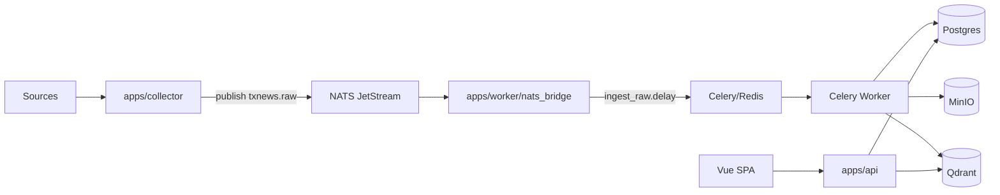
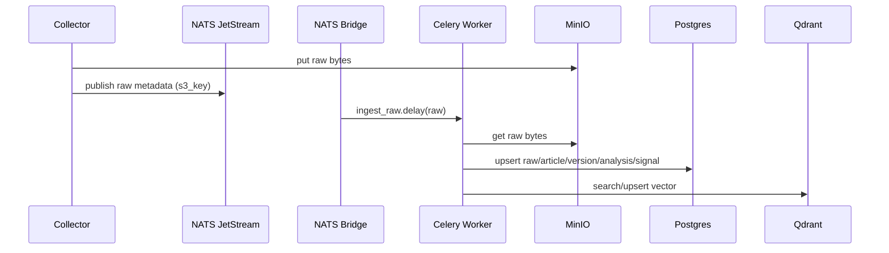

<!-- Input: 项目背景/目标/架构设计信息 + v1（基于 v0 单机架构）的功能与部署方式 -->
<!-- Output: 面向使用者与开发者的使用说明（快速开始/API/UI/架构/方案/取舍/路线图） -->
<!-- Pos: 根目录主文档（变更时同步更新以上注释与所属目录 FOLDER.md） -->

# TX-news 高时效经济新闻拉取与分析系统（v1）

*目标是在单机可自托管的前提下，完成 **采集 → 清洗 → 去重 → 入库 → 向量检索 → 结构化分析 → 信号/对话** 的闭环（UI/API/MCP）。*

核心约束：
- 尽量自建/自托管：Postgres/Redis/NATS/MinIO/Qdrant 本地可跑。
- LLM 可选：无 API Key 时走规则降级；有 Key 时增强结构化分析与对话。
- 合规：系统保存 raw 全文用于审计/回放；UI/API 不展示新闻全文，仅展示结构化结果与链接。

快速导航：
- 快速开始：一键部署/启动/验证
- API：检索/对话（含 SSE 流式）/状态接口
- UI：对话页（Markdown）与配置页（按用户设置在线 LLM）
- 架构：调用链、数据流、关键模块与取舍
- v1：可优化方向清单

---

## 1. 快速开始（单机 v1）

### 1.1 前置条件
- Python >= 3.10
- Node.js >= 18 (for frontend build)
- Docker + Docker Compose
- （可选）NVIDIA GPU（用于 vLLM 加速；无 GPU 也可跑，embedding 默认使用 CPU，除非显式设置 `TXNEWS_EMBEDDING_DEVICE`）
- 网络：需要拉取 Docker 镜像；首次运行可能需要下载 embedding 模型与（可选）torch wheel

### 1.2 一键启动
1) 配置环境变量：
- `cp .env.example .env`
- 按需填写：
  - LLM：优先 `TXNEWS_LLM_API_KEY`（OpenAI 兼容），或兼容 `DASHSCOPE_API_KEY`
  - （可选）`HF_ENDPOINT=https://hf-mirror.com`（HuggingFace 镜像）
  - （调试）`TXNEWS_LOG_LEVEL=DEBUG`（打开流式对话关键路径日志）

2) 配置采集源与本地参数：
- 编辑 `config/sources.txt`：每行一个入口 URL（支持 `#` 注释）
- 编辑 `config/config.yaml`：crawler/embedding/llm/tushare 等

3) 启动：
```bash
bash scripts/start.sh
```

启动脚本会：
- 创建 `.venv` 并安装依赖（可自动安装合适的 torch CPU/CUDA 版本）
- 设置 HuggingFace 镜像/缓存并做 embedding 预检（提前下载/加载模型）
- （可选）当 `.env` 设置 `TXNEWS_ACCELERATOR=gpu` 时，启动本地 vLLM（用于 worker 常规分析 + 深分析，优先节约 token 成本）
- `docker compose up -d` 启动 Postgres/Redis/NATS/MinIO/Qdrant
- 启动后台进程：Celery worker、NATS bridge、Collector、API（8000）、Config（8001，可选）
- 启动完成后做健康检查（API `/health`；若启用 vLLM 则检查 `/v1/models`）

常用启动参数（写入 `.env`）：
- `AUTO_TORCH=0/1`：是否自动安装 torch
- `TORCH_VARIANT=cpu|cu121|cu124`：强制 torch 版本选择
- `PREFLIGHT_EMBEDDING=0/1`：是否启动前预检 embedding（建议开启）
- `HF_HOME=var/hf`：HuggingFace cache 目录
- `TXNEWS_ACCELERATOR=cpu|gpu|auto`：CPU/GPU 模式（`gpu` 会尝试启动本地 vLLM，并让 worker 常规分析 + 深分析优先走 `llm.deep`；不可用时回退到 `llm.chat`）
- `TXNEWS_EMBEDDING_DEVICE=cpu|cuda:1|...`：embedding 设备显式指定（默认 `cpu`；设置后覆盖默认行为）
- `TXNEWS_VLLM_SCRIPT=...` / `TXNEWS_VLLM_PORT=...`：一键启动时 vLLM 启动脚本与端口（默认 `9999`）

多 GPU（例如 4090×2）建议：
- v1 是“多进程”模型：worker/API/collector 都是独立进程；vLLM 会自动使用两张 GPU（tensor-parallel-size=2）解决 KV 缓存不足问题。
- `config/config.yaml: embedding.model_name` 默认选用较大中文向量模型；若你更关注速度或显存占用，可换为 `BAAI/bge-small-zh-v1.5`（质量/速度权衡）。
- embedding 默认使用 CPU（除非显式设置 `TXNEWS_EMBEDDING_DEVICE`），通常无需占用 GPU 资源。

4) 打开页面：
- 对话 UI：`http://localhost:8000/`
- 配置页（按用户设置在线 LLM）：`http://localhost:8000/config`（单端口/反代/Cloudflare Tunnel 推荐）
- （可选）独立配置服务：`http://localhost:8001/`（本机多端口可用时）
- 健康检查：`http://localhost:8000/health`

### 1.3 快速验证
```bash
curl -s http://localhost:8000/health
curl -s http://localhost:8000/status | jq .
```
对话页侧栏会展示基础计数与依赖健康（来自 `/status`）。

### 1.4 停止
```bash
bash scripts/stop.sh
```
（仅停止 `start.sh` 拉起的本地进程；Docker infra 仍在运行，需手动 `docker compose down` 才会停止）

### 1.5 手动启动（仅 infra 或开发模式）
- 仅启动基础设施：
```bash
docker compose up -d
```
- 单独启动 API：
```bash
uvicorn apps.api.main:app --reload --port 8000
```
- 单独启动 worker：
```bash
celery -A tx_news.tasks.celery_app.celery_app worker -l INFO --pool=solo --concurrency=1
```

### 1.6 推荐配置（GPU 方案 / CPU 方案）

#### A) GPU 方案（推荐：4090×2）
目标：vLLM 全程走 GPU，embedding 使用 CPU，API/Worker 可分卡，保证吞吐与时延稳定。

`.env` 推荐：
```bash
HF_ENDPOINT=https://hf-mirror.com
HF_HOME=var/hf
TORCH_VARIANT=cu121
PREFLIGHT_EMBEDDING=1
TXNEWS_LOG_LEVEL=INFO
TXNEWS_ACCELERATOR=gpu
# TXNEWS_EMBEDDING_DEVICE=cpu  # embedding 默认使用 CPU（除非显式设置为 cuda:...）
# (optional) if you use the bundled vLLM script:
# TXNEWS_VLLM_PORT=9999
```

`config/config.yaml` 推荐：
```yaml
embedding:
  model_name: BAAI/bge-large-zh-v1.5
  # device 推荐使用 CPU（v1 默认会覆盖为 cpu，除非设置 TXNEWS_EMBEDDING_DEVICE）
  device: cpu
  use_fp16: false  # 仅在 GPU 上有效，CPU 模式下会被忽略
  qdrant_collection_strategy: auto

crawler:
  max_concurrency: 1

llm:
  max_concurrency: 2
  timeout_seconds: 60
```

分卡建议（手动启动时）：
- GPU0 跑 worker：`CUDA_VISIBLE_DEVICES=0 celery -A tx_news.tasks.celery_app.celery_app worker -l INFO --pool=solo --concurrency=1`
- GPU1 跑 API：`CUDA_VISIBLE_DEVICES=1 uvicorn apps.api.main:app --port 8000`

模型选择建议：
- 更稳更快：`BAAI/bge-large-zh-v1.5`（默认）
- 更强但更慢/更大：`BAAI/bge-m3`（首次下载更慢；适合更高质量召回）

#### B) CPU 方案（无 GPU / 仅 CPU）
目标：降低下载体积与 CPU 压力，保证“可跑通 + 低资源占用”。

`.env` 推荐：
```bash
HF_ENDPOINT=https://hf-mirror.com
HF_HOME=var/hf
AUTO_TORCH=1
TORCH_VARIANT=cpu
PREFLIGHT_EMBEDDING=1
TXNEWS_LOG_LEVEL=INFO
TXNEWS_ACCELERATOR=cpu
```

`config/config.yaml` 推荐：
```yaml
embedding:
  model_name: BAAI/bge-small-zh-v1.5
  device: cpu
  use_fp16: false
  qdrant_collection_strategy: auto

crawler:
  max_concurrency: 1

llm:
  max_concurrency: 1
  timeout_seconds: 60
```

---

## 2. API 使用方法（HTTP）

API 由 `apps/api/main.py` 提供，默认端口 `8000`。

FastAPI OpenAPI：
- Swagger UI：`http://localhost:8000/docs`
- ReDoc：`http://localhost:8000/redoc`

### 2.1 基础接口
- `GET /health`：存活
```bash
curl -s http://localhost:8000/health
```

- `GET /search?q=...&limit=10`：知识库向量检索（Qdrant 召回 + Postgres 回表组装；不返回新闻原文）
```bash
curl -s "http://localhost:8000/search?q=央行%20降准&limit=10" | jq .
```

- `/search` 响应字段（`SearchHit`）：
  - `canonical_id`：归并后的文章 ID（去重后稳定）
  - `score`：Qdrant 相似度分数（越大越相似）
  - `title/url/published_at`：最新版本标题与链接
  - `event_type`：分析产出的事件类型
  - `tickers`：分析产出的相关标的（结构化 JSON）

- `GET /articles/{canonical_id}`：数据库读取（Postgres；文章元信息 + 分析结果；不返回 `articles.text` 原文）
```bash
curl -s "http://localhost:8000/articles/<canonical_id>" | jq .
```

- （可选）`GET /kb/search?q=...&limit=10`：知识库检索 + 返回抽取后的全文（默认关闭；需设置 `TXNEWS_ALLOW_FULL_TEXT=1`）
- （可选）`GET /kb/articles/{canonical_id}`：返回抽取后的全文（默认关闭；需设置 `TXNEWS_ALLOW_FULL_TEXT=1`）

- `GET /signals?limit=50`：最新信号（breaking/analysis_updated/deep_analysis_updated 等；返回已整理的 title/url/event_type/tickers/summary 字段，适合前端直接展示）
```bash
curl -s "http://localhost:8000/signals?limit=50" | jq .
```

- `GET /events/{event_id}?limit=50`：事件时间线（按 analysis.event_id 聚合）

- `GET /entities/{ts_code}`：A 股主数据（来自本地 DB；由 Tushare/AkShare 同步）

### 2.2 对话接口（SSE 流式）
对话建议使用流式接口（避免长时间无响应）：
- `POST /chat/stream`：`text/event-stream`
  - `event: delta`：增量 token
  - `event: tool`：工具调用
  - `event: done`：最终消息（含 meta.tools/meta.evidence）

示例（仅展示首屏，实际是流式）：
```bash
curl -N -X POST "http://localhost:8000/chat/stream" \\
  -H "Content-Type: application/json" \\
  -d '{"messages":[{"role":"user","content":"总结今天股市新动向"}],"max_steps":6,"recent_minutes":180}'
```

兼容保留：
- `POST /chat`：同步一次性返回（不推荐用于 UI）

### 对话请求参数（`ChatRequest`）：
- `messages`：对话消息数组（`{role,content}`），建议只发送必要上下文
- `recent_minutes`：系统提示词里“优先检索最近 N 分钟”的窗口（默认 180）
- `max_steps`：最多工具回合数（默认 50，过大可能更慢/更贵）

对话响应结构（`done` 的 `message`）：
- `content`：助手输出（Markdown 文本）
- `meta.tools`：工具调用轨迹（便于排障/审计）
- `meta.evidence`：证据链接列表（canonical_id/url/published_at）

### 2.3 状态与配置接口
- `GET /status`：依赖健康（最小集）+ 基础计数（供对话页侧栏展示）
- `GET http://localhost:8000/api/config`：读取当前用户的在线 LLM 配置（cookie 区分用户；默认不缓存，适合反代）
- `POST http://localhost:8000/api/config`：设置当前用户的 base_url/model/api_key（用于对话按用户分摊成本）

---

## 3. 用户界面（UI）说明

### 3.1 对话页（`/`）
- **v1 (Vue 3)**：基于 Vue 3 + TypeScript 重构的 SPA。
  - 支持 SSE 流式对话，实时渲染 Markdown（`marked`）。
  - 侧边栏实时展示信号（Polling），无需手动刷新。
  - 工具调用（Tool Calls）实时可视化展示。
- *v0 (Deprecated)*：原静态 HTML/JS 仍在 `apps/api/static`，但不再作为默认 UI。

### 3.2 配置页（`http://localhost:8000/config`）
- 用于每个前端用户配置自己的在线 LLM（base_url/model/api_key），从而让 `/chat` 与 `/chat/stream` 按用户分摊成本。
- 配置通过 cookie 区分用户，并写入 Redis；如开启 `TXNEWS_REQUIRE_USER_LLM=1`，未配置用户将无法发起对话。

---

## 4. 项目结构与技术栈

### 4.1 目录结构（核心）
- `apps/`
  - `apps/collector/`：采集进程（sources → raw → NATS）
  - `apps/worker/`：NATS → Celery 桥接 + worker 运行
  - `apps/api/`：FastAPI + 静态 UI（对话）
  - `apps/admin/`：配置服务（8001；按用户设置在线 LLM）
  - `apps/mcp/`：MCP server（stdio JSON-RPC），用于外部 Agent 工具接入
- `src/tx_news/`：核心可复用库（crawler/normalize/dedup/embedding/storage/tasks/agent）
- `config/`：本地配置（`config.yaml` + `sources.txt`）
- `scripts/`：本地一键启动/停止
- `var/`：运行态日志与缓存（gitignored）

### 4.2 技术栈（v1）
- 语言：Python 3.10+
- API：FastAPI + Uvicorn
- 异步任务：Celery（broker/backend：Redis）
- 事件总线：NATS JetStream
- OLTP：PostgreSQL（SQLAlchemy）
- 对象存储：MinIO（S3 API）
- 向量库：Qdrant
- Embedding：sentence-transformers（默认 CPU；可用 `TXNEWS_EMBEDDING_DEVICE` 显式覆盖；模型可本地路径或 HF 下载）
- LLM：OpenAI-compatible Chat Completions（默认 DashScope compatible-mode；可替换其它兼容服务）
- 前端：Vue 3 + TypeScript + Vite（SPA），由 API 进程挂载构建产物 `dist_public/`（可选 `dist_admin/`）。

### 4.3 端口与服务（默认）
- 公网 API + 对话 UI：`http://localhost:8000`
- 配置 UI：`http://localhost:8000/config`
- （可选）独立配置服务：`http://localhost:8001/`
- Postgres：`localhost:5432`
- Redis：`localhost:6379`
- NATS：`localhost:4222`（监控 `http://localhost:8222`）
- MinIO：`http://localhost:9000`（console `http://localhost:9001`）
- Qdrant：`http://localhost:6333`

---

## 5. 调用链与数据流（单机实现）

### 5.1 高层数据流


### 5.2 单条新闻的任务链


### 5.3 代码级调用链（从采集到分析）
- `apps/collector/main.py`：周期性抓取 → `tx_news.crawler.collector.Collector.run_once()`
- `apps/worker/nats_bridge.py`：订阅 `${TXNEWS_NATS_STREAM}.raw` → `tx_news.tasks.pipeline.ingest_raw.delay()`
- `src/tx_news/tasks/pipeline.py`：
  - `normalize_raw`：从 MinIO 读取 raw bytes，抽取正文
  - `dedup_store`：LSH 近重复 + Qdrant 语义去重 + 写入 Postgres/Qdrant
  - `analyze`：规则分析 +（可选）LLM JSON 增强 + 写入 analyses/signals
  - `deep_analysis`：仅对新 canonical 且 LLM 可用触发深分析（二次推理）

关键消息与任务名（便于对齐“数据流/调用链”）：
- NATS subject：`${TXNEWS_NATS_STREAM}.raw`（默认 `txnews.raw`）
- Celery 任务（示例）：`tx_news.tasks.pipeline.ingest_raw` / `normalize_raw` / `dedup_store` / `analyze`

---

## 6. 核心模块与技术细节

### 6.1 采集（Collector）
- 输入：`config/sources.txt`
- 输出：raw bytes → MinIO；raw metadata → NATS（subject: `${TXNEWS_NATS_STREAM}.raw`）
- v0 策略：每 60 秒 `run_once()`；可用 `crawler.max_concurrency` 控制并发与 `max_retries` 控制重试

### 6.2 清洗与正文抽取（Normalize）
- `readability-lxml` 抽取正文；尽量产出 `title/text/checksum/published_at`
- 失败时 raw 仍保留在 MinIO，可回放重跑

### 6.3 去重（LSH + 语义）
目标：把跨源转载/同稿归并到 `canonical_id`，并保留版本链路。

流水线（v0）：
1) LSH（MinHash）近重复：快速过滤同稿/轻微改写
2) embedding 语义去重：对非近重复候选计算向量，Qdrant 搜索 top1，相似度超过阈值则归并

关键参数（v0 默认）：
- LSH 阈值：`0.85`（见 `src/tx_news/dedup/lsh.py`）
- 语义归并阈值：`score >= 0.92`（见 `src/tx_news/tasks/pipeline.py`）

### 6.4 Embedding（GPU/CPU）
- 配置项在 `config/config.yaml:embedding`：
  - `model_name`：HF repo id 或本地目录
  - `device`：`auto/cpu/cuda/cuda:0`
  - `use_fp16`：GPU 建议开启
  - `qdrant_collection_strategy`：`auto/base/scoped`
- v1 默认强制 embedding 使用 CPU（除非显式设置 `TXNEWS_EMBEDDING_DEVICE`）。
- Qdrant 兼容：
  - point id：Qdrant 只接受 `int/uuid`，v0 使用确定性 UUID（uuid5）写入，同时把原 `canonical_id` 放入 payload，检索时优先从 payload 取回 canonical_id。
  - collection：若换模型导致向量维度变化，`auto` 会自动切换到 `base__<model>__<dim>`，避免维度不匹配直接报错。

Embedding 启动前预检（preflight）：
- 目标：把“下载/加载模型”前置到启动阶段，避免 worker 运行到一半才报错。
- 建议：保持 `PREFLIGHT_EMBEDDING=1`；并设置 `HF_ENDPOINT=https://hf-mirror.com` 与 `HF_HOME=var/hf` 以提升稳定性。

### 6.5 分析（规则 + 可选 LLM）
- 无 LLM：规则分类/事件窗口/实体匹配仍可跑通主流程
- 有 LLM：对 `analyze` 与 `deep_analysis` 进行 JSON 结构化增强
- LLM 配置优先级：
  1) `.env`：`TXNEWS_LLM_BASE_URL/TXNEWS_LLM_MODEL_NAME/TXNEWS_LLM_API_KEY`
  2) `.env` 兼容：`DASHSCOPE_API_KEY/OPENAI_API_KEY`
  3) `config/config.yaml: llm.*`

LLM “OpenAI 兼容三件套”示例（适配任意兼容服务）：
```bash
TXNEWS_LLM_BASE_URL="https://<your-openai-compatible-host>/v1"
TXNEWS_LLM_MODEL_NAME="<model-name>"
TXNEWS_LLM_API_KEY="<api-key>"
```

### 6.6 A 股主数据（Tushare/AkShare）
- 缓存文件：`var/cache/a_share/stock_basic.json`
- 默认 TTL：12 小时（`tushare.cache_ttl_hours`）；未过期直接使用缓存入库，避免频繁请求
- 失败回退：Tushare → AkShare → 本地 cache

维护入口（手动触发）：
- `python -m apps.sync_tushare`：同步/刷新主数据缓存并入库（通常不需要频繁运行）

### 6.6.1 Raw 保留与清理（Retention）
- `retention.raw_days` 控制 raw 全文与抓取记录的保留天数（默认 7 天）
- 维护任务：`tx_news.tasks.maintenance.cleanup_raw`（删除过期 raw 记录与 MinIO 对应对象）

### 6.7 MCP 工具服务（stdio）
`apps/mcp/server.py` 提供最小 MCP/JSON-RPC 工具接口，适合外部 Agent/编排器通过 stdio 集成检索能力。
```bash
python -m apps.mcp.server
```

### 6.7.1 本地微调 LLM（Deep Analyse）与训练集规则
本项目支持在 GPU 模式下让 **worker 常规分析 + 深分析** 优先使用本地 vLLM（OpenAI-compatible `/v1/chat/completions`），以降低 token 成本并提升输出 JSON 的稳定性；对话（`/chat`）仍可保持云端模型（`llm.chat`）。

相关目录/文件（以实际文件为准）：
- 微调与推理入口：`finetune/README.md`、`finetune/sft.yaml`、`finetune/run_sft.sh`、`finetune/serve_vllm.sh`
- 训练集：`finetune/txdatasets/README.md`（生成规范）、`finetune/txdatasets/dataset_info.json`、`finetune/txdatasets/txnews_deep_analysis_sft_alpaca.jsonl`
- 已发布模型（下载）：ModelScope `MarkTom/txnews-DeepSeekR1`（https://modelscope.cn/models/MarkTom/txnews-DeepSeekR1；本项目 deep model name 默认 `deepseekr1-merged`；模型卡见 `finetune/result_model/deepseekr1_merged/README.md`）

训练样本选取与生成规则（摘要版）：
- **合规/安全**：训练集不得包含新闻原文；仅允许“改写后的摘要要点 + 链接/时间等元信息 + 结构化输出 JSON”。
- **输入字段（贴近线上 prompt）**：目标新闻标题、摘要要点（脱敏改写）、初步分析（`analysis.data`）、相似新闻证据包（TopN 元信息：canonical_id/score/title/url/published_at）、事件窗口 `minutes`（来自 `config/config.yaml:event_windows_minutes`）。
- **输出格式（强约束）**：仅输出 1 个 JSON 对象且可 `json.loads` 解析；至少包含 `event_type, entities, tickers, impact, index_view, evidence` 六个字段；不得输出 markdown/解释/长引用。
- **不可幻觉约束**：`evidence[*].url` 必须来自输入证据包 URL 集合；`tickers[*].ts_code` 不得凭空新增（应来自输入候选或你维护的 name→ts_code 映射）。
- **覆盖与配比**：样本需覆盖 `policy/macro_data/liquidity/company_event/geopolitics/industry_supply_demand/other`；建议包含一定比例“初步分析错误→深分析纠错”与“证据不足→输出 uncertain”的样本。
- **自动质检（建议强制）**：解析 JSON、字段齐全、event_type 合法、evidence URL 不越界、tickers schema 稳定（建议统一为 `[{ts_code,name,confidence?}]`），并做去重与长度裁剪（`cutoff_len` 约束）。

### 6.8 数据库与知识库（v0：存储心智模型）
本项目把“可审计的结构化事实”放在 **数据库（Postgres）**，把“语义召回索引”放在 **知识库（Qdrant 向量索引）**，二者用 `canonical_id` 串联：
- **数据库（Postgres）**：事实主存储（canonical/版本链/分析结果/信号/主数据/抓取审计索引）；`articles.text` 与 raw 仅用于内部去重/分析/回放，HTTP API 默认不返回原文（合规/版权）。
- **知识库（KB = Qdrant 向量索引 + Postgres 回表）**：`/search` 先在 Qdrant 做向量召回拿到 `canonical_id`（与少量 payload），再回表 Postgres 拼装 `title/url/published_at/event_type/tickers` 等结构化字段；Agent/MCP 的 `search_news` 同理。

Postgres 核心表（以 `src/tx_news/db.py` 为准）：
- `raw_documents`：抓取记录（url/status/checksum/s3_key/headers/…；raw bytes 在 MinIO）
- `articles`：canonical 文章（canonical_id/title/text/checksum/lsh_signature/embedding_model/embedding_dim/embedding_ref/…）
- `article_versions`：来源版本链（canonical_id/source_id/url/fetched_at/published_at/raw_s3_key/…）
- `analyses`：结构化分析结果（event_type/data(JSONB)/llm_used/created_at）
- `signals`：系统信号（breaking/analysis_updated/deep_analysis_updated 等）
- `a_share_basic`：A 股主数据（ts_code/name/aliases/…）

Qdrant（知识库向量索引）写入形态（以 `src/tx_news/tasks/pipeline.py:dedup_store()` 为准）：
- 每条 canonical 1 个 point：`vector = embedding(articles.text)`；`point_id` 使用 `canonical_id` 派生的确定性 UUID（兼容 Qdrant id 类型限制）
- payload（最小元信息）：`canonical_id/title/source_id/url/published_at`（用于检索命中后的快速展示/过滤；最终仍以 Postgres 为准）

### 6.9 配置参考（v0 常用项）
推荐只改这两处：`config/config.yaml`（业务参数）与 `.env`（连接串/密钥/运行开关）。

`.env`（常用）：
- `TXNEWS_PG_DSN`/`TXNEWS_REDIS_URL`/`TXNEWS_NATS_URL`/`TXNEWS_S3_*`/`TXNEWS_QDRANT_*`：基础设施连接
- `TXNEWS_LLM_BASE_URL`/`TXNEWS_LLM_MODEL_NAME`/`TXNEWS_LLM_API_KEY`：LLM（OpenAI 兼容）
- `TXNEWS_ALLOW_FULL_TEXT`：是否允许内部 KB 接口返回抽取后的全文（默认 0）
- `DASHSCOPE_API_KEY`：兼容旧方式（未设置 `TXNEWS_LLM_API_KEY` 时会回退）
- `HF_ENDPOINT`/`HF_HOME`：Embedding 模型下载镜像与缓存目录

`config/config.yaml`（常用）：
- `crawler.max_concurrency/per_domain_min_interval_seconds`：抓取并发与限速
- `embedding.model_name/device/use_fp16`：向量模型与设备策略
- `tushare.cache_ttl_hours`：主数据缓存 TTL（默认 12h）
- `event_windows_minutes.*`：事件归并窗口（按 `event_type` 分类）

---

## 7. 关键组件取舍（v0 的选择与优缺点）

### 7.1 NATS JetStream（事件流）
优点：轻量、单机友好、延迟低、易运维；consumer pending 可观测。  
缺点：生态/治理不如 Kafka 完整；大规模多租户时需要更强的隔离策略。

### 7.2 Celery + Redis（任务执行）
优点：Python 生态成熟；重试/并发/任务链简单直接；与现有 Python 代码耦合成本低。  
缺点：复杂编排与可观测性不如专门工作流引擎（Argo/Temporal）。

### 7.3 Postgres（主存储）
定位：**事实主存储（source-of-truth）**，承载可审计数据与结构化结果；API 的 `/articles`、`/signals`、`/events`、`/entities` 主要读路径都来自这里。  
主要存储内容：
- 抓取审计索引：`raw_documents`（抓取时间/状态码/headers/checksum + 对应 MinIO `s3_key`）
- canonical 文章：`articles`（去重后稳定 `canonical_id`，含 `text/checksum` 与 embedding 元信息/引用）
- 来源版本链：`article_versions`（url/published_at/fetched_at/raw_s3_key）
- 分析结果与信号：`analyses`（JSONB）+ `signals`
- 实体主数据：`a_share_basic`（供标的识别与画像）
注意：`articles.text` 会入库用于内部分析/去重，但对外接口默认不返回原文（合规/版权）。

### 7.4 Qdrant（向量库）
定位：**知识库的语义召回索引**（向量检索为主），用于 `/search`、Agent/MCP 的 `search_news`、以及去重/深分析的相似证据召回。  
主要存储内容：
- `canonical_id -> embedding 向量`：每条 canonical 1 个 point（Cosine 相似度）
- payload：少量可展示/可过滤字段（如 `canonical_id/title/source_id/url/published_at`；不存分析 JSON，也不作为最终事实来源）
- collection 策略：支持 `auto/base/scoped`；当 embedding 模型/维度变化时可自动切换到“模型+维度隔离”的 collection（避免维度不匹配）

### 7.5 MinIO（对象存储）
优点：保留 raw 全文用于审计/回放；与 DB 解耦；成本低。  
缺点：需要额外组件；需要 TTL/生命周期管理策略。

### 7.6 sentence-transformers 本地 embedding
优点：可离线、自主可控；GPU 可显著提速；一处向量可复用于去重/检索。  
缺点：模型下载与缓存管理需要规范；模型升级会带来向量维度/分布变化。

### 7.7 常见替代方案对比（v0 取舍）

| 目标 | v0 方案 | 常见替代 | v0 取舍原因（简述） |
| --- | --- | --- | --- |
| 事件流 | NATS JetStream | Kafka/Redpanda | 单机起步更轻；延迟低；运维成本更小（大规模治理不如 Kafka）。 |
| 任务编排 | Celery + Redis | Temporal/Argo/Airflow | Python 生态直连、改造成本低；复杂工作流/可观测性可在 v1 引入。 |
| 向量检索 | Qdrant | pgvector/FAISS/ES kNN | Qdrant 过滤+性能更稳、独立扩展；pgvector 更省组件但检索/过滤能力受限。 |
| raw 存储 | MinIO(S3) | 本地 FS/OSS | raw 用于审计/回放，S3 接口利于后续扩展；单机也能跑。 |
| LLM | OpenAI-compatible API | 本地 vLLM/self-host | v0 默认“可选 LLM”：先把数据链路跑通；本地推理可在 v1 做成本与延迟优化。 |

---

## 8. 运维与排障（Troubleshooting）

### 8.1 常见依赖问题
- Qdrant `ApiException`：优先看 `/status` 的 `dependencies.qdrant.ok` 与错误信息；确认 `docker compose ps` 中 qdrant 正常、`TXNEWS_QDRANT_URL` 可达。
- embedding 无法加载/超慢：设置 `HF_ENDPOINT=https://hf-mirror.com`、`HF_HOME=var/hf`，并开启 `PREFLIGHT_EMBEDDING=1`。
- GPU 不生效：确认 `nvidia-smi` 可用；torch 是否为 CUDA 版本；必要时设置 `TORCH_VARIANT=cu121|cu124` 重新启动（或 `AUTO_TORCH=0` 自己管理 torch）。
- Postgres `FATAL: sorry, too many clients already`：
  - 症状：API（如 `/status`）或 worker/collector 入库路径报 `sqlalchemy.exc.OperationalError`，日志提示连接数已满。
  - 处理：先重启本仓库进程释放连接（`bash scripts/stop.sh && bash scripts/start.sh`），再观察 `var/log/api.log`/`var/log/celery_worker.log` 是否仍持续报错。
  - 根因说明：长跑场景需要复用进程内 SQLAlchemy `Engine`/连接池；若代码在高频路径里反复创建 `Engine`，会快速耗尽 Postgres 连接。

### 8.2 对话“长时间无回复”
- 建议使用 `/chat/stream`；并把 `TXNEWS_LOG_LEVEL=DEBUG` 打开以观察：
  - API：`chat_stream start/first_delta/done`（TTFB、token 增量、工具调用）
  - 工具：`tool_call name=...`（卡住通常在检索/向量化/DB/Qdrant）

### 8.3 日志与定位
- 日志目录：`var/log/`
- 常用日志名：`api`、`collector`、`nats_bridge`、`celery_worker`、`bootstrap`

### 8.4 Cloudflare Tunnel / 反代仅暴露单端口
- 若仅能访问 `8000`：使用配置页 `http://<host>:8000/config`（而不是 `8001`），并确保反代不要缓存 `/status`、`/signals`、`/dashboard/summary`（本项目已对这些接口默认设置 `Cache-Control: no-store`）。

---

## 9. v1 可优化方向（路线图）

### 9.0 v1 已实现（迭代总结）
- 前端：Vue 3 + TS SPA（public：对话 + 看板；admin：配置页），SSE 流式对话 + 工具进度可视化（完成后自动折叠），侧栏统计包含轮询接口平均耗时。
- API：用户侧提供 `/search`（向量检索）、`/chat/stream`（SSE）、`/status`（最小依赖/计数）、`/dashboard/summary`（看板聚合）；并提供 `/api/config`（按用户设置在线 LLM；单端口反代可用），对 `tickers` 等字段做兼容处理以避免 500。
- 存储与稳定性：SQLAlchemy Engine 进程内复用，降低长跑场景 Postgres 连接数膨胀风险；Qdrant collection 支持按模型/维度策略自动兼容。
- 集成：提供 `apps/mcp/server.py`（stdio JSON-RPC）用于外部 Agent/LLM 以 MCP 方式调用知识库/数据库检索能力。

v1 建议聚焦“检索质量 + 可观测性 + 成本治理 + 规模化”：
- 检索与证据定位
  - chunking + chunk 向量（证据更精确）
  - 混合检索（向量召回 + 关键词/过滤 + 重排）
  - 事件级向量与时间线摘要向量（Event-Centric RAG）
- 分析质量与可回放
  - prompt/schema 版本化；输出幂等缓存与回放工具
  - 规则/LLM 的 A/B 对比与质量评测集（离线评测）
- 资源与吞吐
  - 多进程/多队列：embedding 与 LLM 调用隔离；GPU worker pool
  - 更细粒度限流与熔断（按 provider/模型/源站）
- 可观测性与运维
  - 指标体系（Prometheus/OpenTelemetry）与 tracing（替代仅日志）
  - 更强的管理台：任务队列长度、重试率、失败分布、耗时分位数
- 安全与产品化
  - API Key/Auth、速率限制、审计日志
  - 多租户/多市场扩展（A 股以外的实体库与规则集）

---

## 10. 开发与测试
- 代码风格：`ruff`（`pyproject.toml`）
  - `ruff check .`
- 测试：`pytest -q`（如已安装 `requirements-dev.txt`）

---

## 11. 重构与更新说明 (2025-12-29)

### 11.1 前端重构 (Frontend Refactor)
- **架构变更**：从原生静态文件 (`apps/api/static/`) 迁移至现代前端工程 (`apps/web/`)。
  - 技术栈：Vue 3 + TypeScript + Vite + Vue Router。
  - 构建产物：`apps/web/dist_public/`（对话+看板+配置入口；8000 挂载）与 `apps/web/dist_admin/`（可选独立配置页；8001 挂载）。
- **功能增强**：
  - 构建模式区分：public/admin 输出不同 bundle（多端口部署时可将配置 UI 独立到 `8001`；单端口部署也可直接使用 `8000/config`）。
  - 交互优化：流式对话增加工具调用可视化（进度栏 + 完成自动折叠），侧栏增加轮询接口平均耗时统计。
- **运维集成**：
  - `scripts/start.sh` 增加 Node.js 环境检查与自动构建步骤（`npm install && npm run build:all`），并启动 8000/8001 两个端口服务。

### 11.2 文档治理 (Documentation)
- 全面补充了 `FOLDER.md` 目录索引，覆盖 `src/` 根目录及 `apps/web/` 各级子目录。
- 确保每个关键模块（Views, Router, Components）都有架构说明。

### 11.3 废弃/保留 (Deprecation)
- `apps/api/static/`：原静态资源文件夹已不再被 API 默认引用，但保留用于参考或回滚。
- 分析 LLM：目前支持通过 `.env` 配置本地 vLLM（OpenAI 兼容接口）以替代云端 API，从而降低 Token 消耗。

### 11.4 大模型微调：分析链路本地化、对话保留云端 (2025-12-30)

修改范围（Scope）：
- **仅替换“深度分析”模块的 LLM**：`src/tx_news/tasks/deep_analysis.py` 的二次推理与结构化回写计划切换到本地微调模型。
- **用户对话保持 API 模型**：`/chat` 与 `/chat/stream` 仍使用云端/外部 OpenAI-compatible API，优先保证回答效果与稳定性。
- **数据合规**：微调数据集只包含“改写后的摘要要点 + 链接/时间等元信息 + 结构化输出”，不包含新闻原文。

实现方案（Implementation Plan）：
1) **准备数据集（LLaMA-Factory）**：
   - 数据目录：`finetune/txdatasets/`
   - 数据集名：`txnews_deep_analysis_sft`（见 `finetune/txdatasets/dataset_info.json`）
   - 训练文件：`finetune/txdatasets/txnews_deep_analysis_sft_alpaca.jsonl`
2) **SFT 微调**：按 `finetune/sft.yaml` 配置 `dataset_dir=finetune/txdatasets`、`dataset=txnews_deep_analysis_sft`，运行 `bash finetune/run_sft.sh`。
3) **本地推理服务**：用 `finetune/result_model/deepseekr1_merged/serve_vllm_gpu0_9999.sh` 启动 vLLM（conda env: `vllm`），默认：
   - `CUDA_VISIBLE_DEVICES=0`（GPU0）
   - `PORT=9999`（`base_url=http://127.0.0.1:9999/v1`）
   - `SERVED_MODEL_NAME=deepseekr1-merged`（`model=deepseekr1-merged`）
4) **队列级分流（可选）**：
   - 将 `tx_news.tasks.deep_analysis.*` 路由到独立队列（例如 `deep`），启动 `deep-worker` 仅消费该队列，并把它的 LLM 指向本地 vLLM；
   - 默认 `worker` 继续消费 `default` 队列（`pipeline.*` 包含 `analyze`），可独立选择指向本地或云端；
   - API 进程的 chat 仍指向云端 API。
   - 备注：本仓库当前默认策略是“GPU 模式下 analyze 与 deep_optimize 都优先走本地 vLLM”，因此是否做队列拆分取决于你是否需要把两条链路分别指向不同模型/资源配额。
5) **代码级分流（已落地）**：
   - worker（`pipeline.analyze()` + `deep_analysis.py`）GPU 模式下优先读取 `llm.deep`（本地 vLLM），失败时回退到 `llm.chat`（需 api_key）；
   - `apps/api` 的 `/chat` 与 `/chat/stream` 仍读取 `llm.chat`（并支持每用户 Redis 配置覆盖）；
   - env 支持：`TXNEWS_LLM_CHAT_*` 与 `TXNEWS_LLM_DEEP_*`（兼容旧的 `TXNEWS_LLM_*` / `DASHSCOPE_API_KEY`）；
   - 双卡建议：在 `.env` 设置 `TXNEWS_ACCELERATOR=gpu`，并用 `TXNEWS_EMBEDDING_DEVICE=cuda:1` 把 embedding 固定到 GPU1（GPU0 留给 vLLM）。
   - CPU 保底：在 `.env` 设置 `TXNEWS_ACCELERATOR=cpu`，worker 分析链路使用在线 LLM（`llm.chat`；无 key 则规则降级）。

预期收益：
- 深分析输出格式更稳定（严格 JSON、事件类型/字段更贴合本项目）。
- Token 成本可控：深分析链路由本地推理承担；对话仍用云端保障体验。

### 11.5 稳定性修复：Postgres 连接池复用 (2025-12-31)
- 背景：长时间运行时，若在高频路径（API 请求/worker 任务/collector）反复创建 SQLAlchemy `Engine`，会导致 Postgres 连接数不断上升直至报错。
- 修复：`tx_news.storage.postgres.make_engine()` 在进程内缓存 `Engine`，并在 `init_db()` 中对同一 DSN 只执行一次 `create_all`，降低长跑场景的连接数风险。
