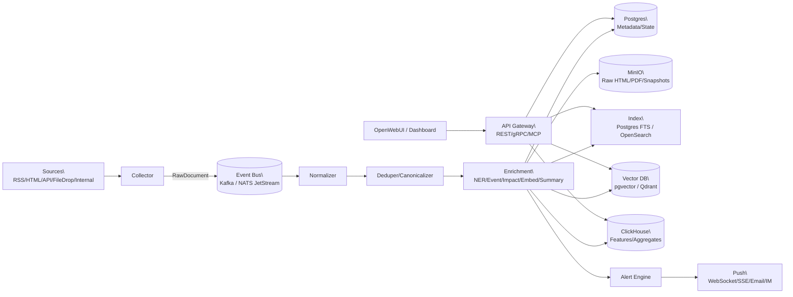
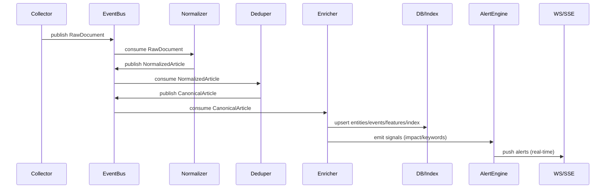

# tx-news
天心：高时效经济新闻拉取与分析系统（设计文档）

> 目标：尽可能自建/自托管地完成“秒级~分钟级”的新闻采集、清洗、结构化、分析、检索与告警；除在线 LLM 外尽量减少对外部数据源依赖。本文档可作为后续实现的工程蓝图与 README。

---

## 0. 目标、约束与关键指标

### 0.1 目标
- 多源新闻拉取（RSS/站点/内部接口/文件投递）→ 统一结构化 → 实时分析（主题/实体/事件/影响评分）→ 检索与看板 → 告警推送。
- 支持回放与版本演进：任意阶段可重跑新版本规则/模型，结果可追溯。

### 0.2 约束
- 外部依赖最小化：消息队列、对象存储、数据库、检索、向量库、监控优先自托管。
- 在线 LLM 仅用于增强：必须提供“无 LLM 降级路径”（规则/传统 NLP/本地模型）。

### 0.3 建议指标（按“1 小时内响应”目标拆分）
- 发现与入库：从“源可见”到“可检索”≤ 10 分钟（目标值，便于后续 RAG/分析调用）。
- 初步分析与告警：≤ 30 分钟（可先给“事件类型/涉及标的/影响方向/置信度”的轻量结论）。
- 完整分析与响应：≤ 60 分钟（补齐跨源归并、时间线、解释性因素与结构化标注）。
- 去重准确率：> 95%（跨源同稿/转载/轻改写）。
- 可追溯：每条新闻从抓取→解析→特征→结论→告警全链路审计。

### 0.4 已确认需求（v0）
1) 数据源：**外网抓取为主**（仍保留内部投递通道作为补充与离线回放入口）。  
2) 时效：**当天突发新闻 1 小时内完成分析并响应**。  
3) 部署：**单机本地部署起步**，后续迁移到 K8s/更大规模平台。  
4) RAG：希望采用**先进且效果好**的方案（本文提供多套可选设计）。  
5) LLM 参与：用于**结构化标注 + 分析推理**，并生成“**个股列表** + **大盘变动**”等下游可用结果。  
6) 语言：**中文**（中文分词/实体/事件模板与评估以中文为主）。  

---

## 1. 系统分块（与五大板块对齐）

本系统拆为五大板块（与最初设想一致），同时在工程上进一步细化为可部署的服务/agent：

1) **金融新闻相关大模型服务（可选/增强项）**  
2) **高时效新闻知识库（采集/清洗/分析/标签/向量/检索）**  
3) **前端与交互（OpenWebUI 二开或自研 Dashboard）**  
4) **对外 API 服务（结构化与推荐/信号输出）**  
5) **调度与 Agent 系统（自动化流水线 + 分析编排）**

---

## 2. 总体架构与调用关系（含图）

### 2.1 数据流架构


### 2.2 单条新闻的时序（从发现到告警）


### 2.3 协议栈建议（系统间调用）
- 采集层：HTTPS（优先 HTTP/2）+ 条件请求（ETag/If-Modified-Since）+ 源级限速/熔断。
- 内部服务：gRPC（HTTP/2 + Protobuf）用于低延迟与强契约；对外 REST（OpenAPI）。
- 事件总线：Kafka 协议（强回放）或 NATS JetStream（轻量低延迟）。
- 存储：Postgres wire；MinIO（S3 API）；ClickHouse native/http；OpenSearch REST。
- 实时推送：SSE（实现简单、单向推送）或 WebSocket（双向交互）。
- LLM：OpenAI 兼容 API（vLLM 部署自建模型；或在线 LLM 作为增强）。
- 给 LLM 的工具接口：MCP（Model Context Protocol）服务化暴露“检索/时间线/告警解释”等能力。

---

## 3. 各模块实现细节与技术栈（多方案与优缺点）

### 3.1 数据采集系统（Collector）
**职责**
- 多源拉取：RSS/Atom、站点 HTML、JSON API、邮件/IM webhook、文件目录投递（离线可用）、内部数据源桥接。
- 统一输出 `RawDocument`：`source_id/url/fetch_time/headers/raw_html_or_text/checksum/storage_ref`。

**外网抓取为主时的关键工程点（v0 必做）**
- 源配置化：每个 `source_id` 维护独立的抓取策略（更新频率、入口页/列表页、正文页规则、UA、代理策略、超时与重试）。
- 站点礼貌与反封禁：按域名做并发与 QPS 限制；对 `429/503` 自适应退避；优先使用条件请求（ETag/If-Modified-Since）。
- 解析失败兜底：正文抽取失败时，至少保留 `raw_html` 与基础元信息，进入“人工/离线重跑队列”。
- Headless 仅作为兜底：默认走静态抓取；遇到强 JS 渲染源再按源启用 `playwright`，并在单机环境下严格限流。

**方案 A：Python（最快落地）**
- 技术：`Python + asyncio + httpx`；RSS：`feedparser`；正文抽取：`trafilatura` 或 `readability-lxml`；反爬（可选）：`playwright`。
- 优点：开发快、生态完整、与 NLP/LLM 集成顺滑。
- 缺点：极高并发下需更严格的性能治理；playwright 资源占用大。

**方案 B：Go 采集 + Python 分析（生产常见组合）**
- 技术：采集：`Go (colly/goquery)`；队列：Kafka/NATS；分析：Python worker。
- 优点：采集稳定、低资源、高并发；分析仍享受 Python 生态。
- 缺点：双语言维护成本；Schema/契约治理更重要。

**方案 C：JVM 企业化**
- 技术：`Java/Kotlin + Spring`；抓取：OkHttp + jsoup；流处理：Kafka Streams/Flink。
- 优点：工程治理强，适合大团队长期运维。
- 缺点：初期速度慢；NLP/LLM 周边不如 Python 直观。

**减少外部依赖的采集策略**
- 强缓存：ETag/Last-Modified + 内容 hash + 本地 BloomFilter（减少重复请求）。
- 内部投递优先：把“文件投递/内部 webhook/内部 MQ”作为主数据入口，外网抓取作为可插拔连接器。

### 3.2 解析与规范化（Normalizer）
**职责**
- HTML→正文抽取、语言识别、时间/作者/栏目提取、链接展开、编码修复。
- 输出 `NormalizedArticle`：稳定 schema（建议版本化 `schema_version`）。

**建议栈（Python）**
- 内容抽取：`trafilatura`（鲁棒）/ `readability-lxml`（轻量）。
- 时间解析：`dateparser` + 源站规则（每源一套轻量 parser）。
- Schema：`Pydantic` + JSONSchema 导出（供多语言消费者使用）。

### 3.3 去重与版本归并（Dedup & Canonicalization）
**目标**
- 同稿多源、转载、改标题、轻微改写的归并；保留版本便于追溯。

**推荐组合**
1) URL 规范化 + `checksum(normalized_text)` 粗去重  
2) SimHash/MinHash（LSH）近重复  
3) 语义去重（可选）：embedding 相似度（本地模型）  
4) 归并：生成 `canonical_id`，保存 `versions[]`（每次变更可审计）

**优缺点**
- SimHash/MinHash：速度快、离线友好；对深度改写弱。
- 向量去重：对改写强；成本高，需向量库与算力。

### 3.4 实时处理与消息系统（Event Bus / Stream）
**方案 A：Kafka（复杂系统优选）**
- 优点：持久化、回放、消费者组成熟；适合“高时效 + 可回放 + 多下游”。
- 缺点：运维复杂度高于轻量方案。

**方案 B：NATS JetStream（轻量低延迟）**
- 优点：部署轻、延迟低；适合 agent 事件驱动与短任务调度。
- 缺点：超大规模回放与生态不如 Kafka。

**方案 C：RabbitMQ / Redis Streams（中等复杂度）**
- 优点：易用；与 Celery/任务模型契合。
- 缺点：日志式大吞吐与回放不如 Kafka。

### 3.5 存储（对象 + OLTP + OLAP）
**推荐分层**
- 对象存储：`MinIO`（自托管 S3）存 raw/html/pdf/snapshots。
- OLTP：`PostgreSQL` 存文章元数据、实体/事件关系、任务状态、审计。
- OLAP（可选）：`ClickHouse` 存特征/日志/聚合（热度、来源对比、情绪分布）。

**低依赖替代**
- 仅 Postgres：组件最少，但高频聚合与海量日志会吃力。

### 3.6 检索（全文/结构化/向量）
**全文检索**
- 方案 A：`OpenSearch/Elasticsearch`（强检索、聚合、near real-time；资源与运维更重）
- 方案 B：`Postgres FTS + pg_trgm`（低依赖、够用；复杂检索与吞吐上限较低）

**向量检索（用于相似新闻、语义聚类、RAG）**
- `pgvector`：最少组件；适合中小规模。
- `Qdrant`：自托管简单、性能好；适合中等规模与生产化。
- `Milvus`：大规模强，但运维更复杂。

### 3.7 分析层（NLP/规则/本地模型/在线 LLM）
**任务**
- 实体识别与链接：公司/机构/人/国家/宏观指标（CPI/PMI/利率等）
- 事件抽取：加息/降息/并购/制裁/破产/财报超预期
- 影响评分：对大盘/行业/个股/商品/汇率的潜在影响（尽量可解释）
- 聚类与主题演化：热点事件聚类、跨源时间线

**“无 LLM”基础路径（建议必须可用）**
- 词典+规则：行业/公司别名、宏观指标模板、事件触发词与正则模式
- 传统 NLP：`HanLP`（中文友好）/ `spaCy`；分类器可用轻量模型微调
- Embedding：本地 embedding 模型（如 `bge-m3`/`e5` 系列）用于聚类/相似检索

**在线 LLM 增强（可选）**
- 用于摘要、归因解释、复杂事件归纳、生成“可读的分析报告”
- 必须缓存输出（按 `canonical_id + prompt_version` 幂等存储），避免重复调用

---

## 4. 调度系统与 Agent 设计（实现方案与调用逻辑）

### 4.1 Agent 划分（建议）
**采集类**
- `SourceWatcherAgent`：按源策略触发拉取（cron/事件/自适应频率）
- `FetcherAgent`：请求/重试/限速/缓存/落地 MinIO

**处理类**
- `NormalizeAgent`：正文抽取与字段规范化
- `DedupAgent`：近重复检测与 canonical 归并
- `EntityAgent`：实体识别与链接（词典/模型/LLM）
- `EventAgent`：事件抽取（规则/分类器/LLM）
- `EmbeddingAgent`：向量化写入向量库
- `ImpactScoringAgent`：影响评分与可解释因子生成
- `SummarizeAgent`：多粒度摘要（1句/要点/时间线）

**业务类**
- `AlertAgent`：规则/模型触发告警，支持抑制（silence）与告警去重
- `TimelineAgent`：热点聚类与时间线维护

### 4.2 调度：控制面/数据面
```mermaid
flowchart TB
  subgraph ControlPlane[Control Plane]
    SCH[Scheduler\\n(priority+SLA)]
    REG[Agent Registry\\n(version/capability)]
    STATE[(Task State DB\\nPostgres)]
  end

  subgraph DataPlane[Data Plane]
    Q[(Task Queue\\nKafka/NATS/Rabbit)]
    WCPU[Worker Pool\\nCPU]
    WGPU[Worker Pool\\nGPU/LLM]
  end

  SCH -->|enqueue task| Q
  Q --> WCPU
  Q --> WGPU
  WCPU -->|heartbeat/result| STATE
  WGPU -->|heartbeat/result| STATE
  REG --> SCH
  STATE --> SCH
```

### 4.3 任务模型（强烈建议幂等 + 引用传递）
- `Task`：`task_id/agent/input_ref/priority/deadline/retries/idempotency_key/agent_version`
- 输入输出尽量用引用（对象存储 key、数据库 id），避免把大正文放入队列。
- 幂等键建议：`hash(canonical_id, agent, agent_version, prompt_version)`；写入端用 upsert 保证可重试。

### 4.4 编排与降级
- 核心 DAG：`Fetch -> Normalize -> Dedup -> Enrich -> (Index/Alert)`
- 旁路允许失败不阻塞：`Embedding/Summary` 失败不影响 `Alert`。
- 优先级：突发/关键源/关键实体提升 priority；告警链路优先于耗时聚类/长摘要。
- SLA（按 1 小时目标拆层）：  
  - T+10m：入库可检索（用于后续 RAG/回放/人工确认）  
  - T+30m：初步标签与信号（事件类型/涉及标的/影响方向/置信度）  
  - T+60m：完整分析报告（跨源归并、时间线、解释因子、结构化落库与告警抑制）  

### 4.6 “1 小时内响应”的双通道策略（推荐）
为兼顾时效与质量，建议把分析拆成 **Fast Path** 与 **Deep Path** 两条通道：

- **Fast Path（用于 T+30m 内响应）**  
  - 触发点：`Normalize + Dedup` 完成后立即进入  
  - 内容：规则/轻量模型 + 必要的 LLM（可选）输出“事件类型、涉及实体/个股、影响方向、置信度、触发原因（证据引用）”  
  - 产物：`BreakingSignal`（可直接驱动告警/看板/对外 API）

- **Deep Path（用于 T+60m 内完整分析）**  
  - 触发点：事件簇聚合（`event_id`）形成后  
  - 内容：跨源时间线、分歧点、影响链路解释；必要时走 Agentic RAG（LangGraph）生成“分析报告 + 结构化落库”  
  - 产物：`AnalysisReport`（报告）+ `Annotations`（结构化标注）+ `EventTimeline`（时间线）

**单机运行时的调度要点**
- 使用优先级队列：Fast Path 任务优先；Deep Path 可在低峰或空闲资源运行。
- Worker 分池：CPU 池跑抓取/解析/规则；（可选）GPU/LLM 池跑 embedding/摘要/推理。
- 强幂等：所有产物以 `canonical_id/event_id + version` 做 upsert，确保可重试与可回放。

### 4.5 调度实现方案（可选对比）
**方案 A：Temporal（推荐用于复杂 agent 编排）**
- 优点：工作流/DAG、重试/超时、版本化、审计一体化；适合长任务与可靠性要求高的系统。
- 缺点：部署与学习成本高于 Celery。

**方案 B：Prefect（Python 友好）**
- 优点：DAG 易写，适合 Python 团队；可自托管。
- 缺点：对“超高频微任务”需要额外治理并发与队列策略。

**方案 C：Celery + Redis/Rabbit（最快落地）**
- 优点：上手快；工程化成熟。
- 缺点：复杂编排/回放/版本化审计需要额外工程补齐。

**方案 D：LangGraph（偏“LLM Agent 流程编排”，适合板块 5 的分析调度）**
- 适用：把“检索→分析→生成报告→验证/自检→写回知识库”做成可观测的图流程。
- 建议：与 Temporal/Kafka 的“数据流水线”解耦，LangGraph 负责“分析型多步推理链”，基础 ETL 仍走可靠流水线。

---

## 5. LLM 服务与 RAG（板块 1/2/3 的关键接口）

### 5.1 自建模型微调与部署（建议路线）
- 微调工具：`LLaMA-Factory` + LoRA/QLoRA
- 数据：金融新闻/财经对话对齐；可用大模型生成高质量 SFT 数据（需人审/规则筛）
- 部署：`vLLM` 提供 OpenAI 兼容 API（`/v1/chat/completions` 等）

### 5.2 RAG 方案（先进可选，并给出取舍）

#### 方案 A：时间感知的 Hybrid RAG（推荐作为 v0 默认）
**核心思路**
- 检索：全文（Postgres FTS/OpenSearch）+ 向量（pgvector/Qdrant）混合召回。
- 时间加权：对“越近的新闻/事件簇”施加更高权重（recency bias），避免旧闻污染。
- 重排：本地 reranker（可选）+ 规则约束（必须包含发布时间、来源多样性等）。
- 组装上下文：以“事件簇/时间线”为单位拼上下文，而非逐条新闻堆叠。

**优点**
- 组件与实现复杂度适中，单机可跑，效果稳定，可逐步增强。

**缺点**
- 对“跨事件推理/隐含关系”能力有限，需要后续引入图结构或 agent 流程增强。

#### 方案 B：事件中心 RAG（Event-Centric RAG，适合新闻/突发）
**核心思路**
- 先把新闻归并到 `event_id`（聚类/规则/语义相似 + 时间窗口），并维护每个事件的“时间线摘要”。
- 检索时优先检索事件（event）而非文章（article）：返回 `event timeline + top sources + key entities + key claims`。
- 生成回答时引用“事件时间线”，同时给出“最新进展/确认程度/分歧点”。

**优点**
- 噪声低、可解释强，非常贴合“突发新闻 1 小时响应”的工作方式。

**缺点**
- 需要先把聚类与事件建模做扎实；冷启动阶段事件质量依赖规则/聚类参数。

#### 方案 C：GraphRAG（知识图谱增强，适合“实体/关系/因果链”）
**核心思路**
- 维护实体-事件-指标-市场的图结构（公司/行业/宏观指标/政策/商品/汇率等）。
- 查询时：先做实体识别与链接 → 子图检索（相关实体、相关事件、历史相似情景）→ 再做文档检索补证据。

**优点**
- 对“关系链、因果链、关联标的扩散”的解释能力更强，适合做大盘/行业联动分析。

**缺点**
- 工程投入更大；图谱质量决定上限（需要持续维护实体词典与关系抽取）。

#### 方案 D：Agentic RAG（LangGraph/工具调用链，适合“多步分析报告”）
**核心思路**
- 以 LangGraph 把流程固化为：`检索→归并→证据检查→标注→生成报告→自检→写回`。
- LLM 只做“推理与表达”，检索/归并/计算/验证全部工具化（MCP/内部 API）。

**优点**
- 对“分析推理 + 结构化落库 + 报告生成”这类复杂任务最贴合。

**缺点**
- 调试成本高；需要严格的结构化输出约束与缓存，否则成本与不稳定性会上升。

#### 选择建议（结合已确认需求）
- v0 默认：**方案 A（时间感知 Hybrid）+ 方案 B（事件中心）**，优先保障“1 小时内响应”的稳定性与可解释性。
- v1 增强：引入 **方案 D（Agentic）** 做“突发事件分析报告”流水线。
- v2 增强：引入 **方案 C（GraphRAG）** 做“行业扩散/关联标的/宏观链路”解释。

#### 工具接口（给 LLM 的最小集合）
- `search_news(query, time_range, sources, top_k)`
- `get_event_timeline(event_id)`
- `get_entity_profile(entity_id)`（公司/行业/宏观指标画像）
- `get_market_snapshot(date_time)`（可先只读本地缓存或内部数据源）
- `write_annotations(canonical_id, schema_version, payload)`

### 5.3 “在线 LLM”最小化策略
- 仅用于高价值环节：深度摘要、影响解释、跨源归因与报告生成
- 强缓存：按输入引用与 prompt 版本缓存输出；失败自动降级到规则/抽取式摘要

### 5.4 结构化标注与推理输出（面向“个股列表 + 大盘变动”）

为支持“自动标注、分析推理、生成个股列表与大盘变动结论”，建议统一一套可版本化的结构化输出（写入 Postgres/ClickHouse/向量库均可引用同一 `canonical_id/event_id`）。

**建议输出要素**
- `event_type`：政策/宏观数据/公司事件/地缘政治/行业供需/市场流动性等
- `entities`：公司/行业/宏观指标/国家/机构（必须做链接：与本地“个股/指数/行业”主数据表对齐）
- `impact`：`scope`（大盘/行业/个股/商品/汇率）、`direction`（利好/利空/不确定）、`horizon`（短/中/长）、`confidence`
- `tickers`：个股列表（含理由与证据引用，允许为空但必须说明原因）
- `index_view`：大盘变动判断（方向/驱动因素/不确定性/风险点），强调“情景化”而非确定性预测
- `evidence`：引用的新闻/数据点列表（`source_id/url/publish_time/quote_span`）

**关键约束**
- 必须“可解释”：影响结论要能追溯到证据与规则/模型输出。
- 必须“可回放”：同一输入在同一 `prompt_version/agent_version` 下可稳定复现（或至少可审计差异）。

---

## 6. 对外服务（API + MCP）

### 6.1 API 服务
- 面向前端与外部系统：新闻检索、事件时间线、影响评分、告警订阅、推荐信号输出。
- 形式：REST（OpenAPI）+ WebSocket/SSE（实时推送）+ gRPC（内部高吞吐）。

### 6.2 MCP 服务（给 LLM 的“工具层”）
- 把知识库能力（检索/时间线/实体画像/告警解释）以 MCP Server 形式暴露，供 OpenWebUI/自研对话前端的 LLM 调用。

---

## 7. 三套推荐落地组合（按团队与资源选择）

1) **复杂系统推荐（强回放 + 强审计）**  
`Kafka + Temporal + Postgres + MinIO + (ClickHouse) + (OpenSearch) + Qdrant/pgvector`

2) **单机起步推荐（匹配“1 小时内响应”，可平滑迁移 K8s）**  
`Celery/Prefect + Postgres + MinIO + Qdrant(pgvector 亦可) + Postgres FTS`（可选加 `OpenSearch/ClickHouse`）

3) **轻量低延迟（事件驱动）**  
`NATS JetStream + Prefect/轻量调度 + Postgres + MinIO + (Qdrant)`

---

## 8. 已确认的关键决策（v0）

1) 数据源：外网抓取为主。  
2) 时效目标：当天突发新闻 **1 小时内完成分析并响应**。  
3) 部署形态：单机本地部署起步，后续考虑迁移 K8s。  
4) RAG：需要先进且效果好的方案（默认建议“时间感知 Hybrid + 事件中心”，见 `README.md:5.2`）。  
5) LLM：参与结构化标注、分析推理，并产出“个股列表/大盘变动”等结果。  
6) 语言：中文。

## 9. 下一步建议补充（用于落到可实现的工程规格）
- 明确“覆盖市场范围”的主数据：A 股/港股/美股/期货/外汇？以及个股主表来源（可先本地静态表，后续再接实时行情）。
- 明确“响应”的定义：业务告警（推送）/写库（API 可取）/生成日报（报告）分别的 SLA。
- 明确合规策略：抓取频率、robots、版权与引用方式（存全文 vs 存摘要+引用链接）。
