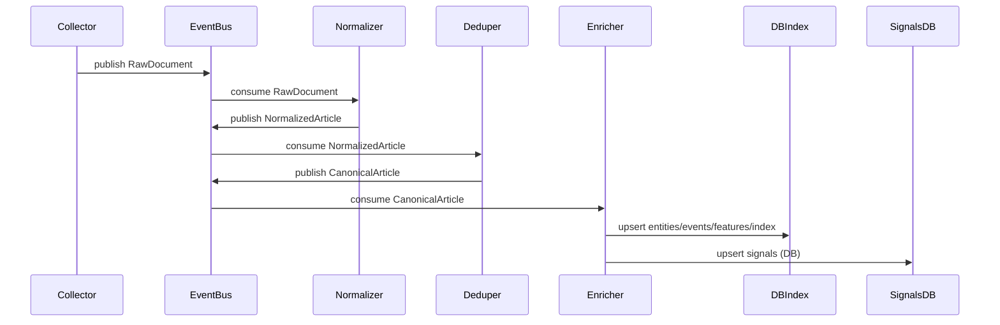

<!-- Input: 项目背景/目标/架构设计信息 -->
<!-- Output: 面向使用者与开发者的设计与使用说明 -->
<!-- Pos: 根目录主文档（变更时同步更新以上注释与所属目录 FOLDER.md） -->

# tx-news
天心：高时效经济新闻拉取与分析系统（设计文档）

> 目标：尽可能自建/自托管地完成“秒级~分钟级”的新闻采集、清洗、结构化、分析、检索与告警；除在线 LLM 外尽量减少对外部数据源依赖。本文档可作为后续实现的工程蓝图与 README。

---

## 0. 目标、约束与关键指标

### 0.1 目标
- 多源新闻拉取（RSS/站点/内部接口/文件投递）→ 统一结构化 → 实时分析（主题/实体/事件/影响评分）→ 检索与看板 → 告警推送。
- 支持回放与版本演进：任意阶段可重跑新版本规则/模型，结果可追溯。

### 0.2 约束
- 外部依赖最小化：消息队列、对象存储、数据库、检索、向量库、监控优先自托管。
- 在线 LLM 仅用于增强：必须提供“无 LLM 降级路径”（规则/传统 NLP/本地模型）。

### 0.3 建议指标（按“1 小时内响应”目标拆分）
- 发现与入库：从“源可见”到“可检索”≤ 10 分钟（目标值，便于后续 RAG/分析调用）。
- 初步分析与告警：≤ 30 分钟（可先给“事件类型/涉及标的/影响方向/置信度”的轻量结论）。
- 完整分析与响应：≤ 60 分钟（补齐跨源归并、时间线、解释性因素与结构化标注）。
- 去重准确率：> 95%（跨源同稿/转载/轻改写）。
- 可追溯：每条新闻从抓取→解析→特征→结论→告警全链路审计。

### 0.4 已确认需求（v0）
1) 数据源：外网抓取为主（保留内部投递通道用于补充与离线回放）。  
2) 时效：当天突发新闻 1 小时内完成分析并响应（响应=入库可检索 + 分析结果写库）。  
3) 部署：单机本地起步，后续迁移 K8s。  
4) 市场：A 股为主。  
5) 检索：向量检索为主（`Qdrant`），全文检索兜底（`Postgres FTS`）。  
6) LLM：基础路径 + 在线增强都实现；在线使用 DashScope `qwen3-max`。  
7) 合规：存全文用于审计/回放，但 UI/API 不展示全文。  
8) 抓取并发：单机全局并发上限为 1。  
9) 事件归并窗口：按事件类型动态配置。  
10) A 股主数据：通过 Tushare（或同类免费平台）拉取，API Key 写入配置文件。  
11) Raw 全文保留：7 天；不做审计删除逻辑（仅按 TTL 清理）。  

---

## 1. 系统分块（与五大板块对齐）

本系统拆为五大板块（与最初设想一致），同时在工程上进一步细化为可部署的服务/agent：

1) **LLM 服务（DashScope `qwen3-max`）**  
2) **高时效新闻知识库（采集/清洗/分析/标签/向量/检索）**  
3) **前端与交互（OpenWebUI 二开或自研 Dashboard）**  
4) **对外 API 服务（结构化与推荐/信号输出）**  
5) **调度与 Agent 系统（自动化流水线 + 分析编排）**

---

## 2. 总体架构与调用关系（含图）

### 2.1 数据流架构
```mermaid
graph LR
  S[Sources] --> C[Collector]
  C --> BUS[NATS JetStream]
  BUS --> N[Normalizer]
  N --> D[Deduper]
  D --> E[Enrichment]
  E --> OLTP[Postgres]
  E --> OBJ[MinIO]
  E --> VDB[Qdrant]
  E --> IDX[Postgres FTS]
  E --> SIG[Signals DB]
  API[API Gateway (REST/MCP)] --> OLTP
  API --> IDX
  API --> VDB
  UI[Dashboard] --> API
```

### 2.2 单条新闻的时序（从发现到告警）


### 2.3 协议栈建议（系统间调用）
- 采集层：HTTPS（优先 HTTP/2）+ 条件请求（ETag/If-Modified-Since）+ 源级限速/熔断。
- 对外服务：REST（OpenAPI）+ MCP（stdio）。
- 事件总线：NATS JetStream。
- 存储：Postgres wire；MinIO（S3 API）；Qdrant gRPC/HTTP。
- LLM：在线 `DashScope API（Qwen3-Max）` + 本地推理（embedding）。
- 给 LLM 的工具接口：MCP（Model Context Protocol）服务化暴露“检索/时间线/告警解释”等能力。

---

## 3. 各模块实现细节与技术栈（多方案与优缺点）

### 3.1 数据采集系统（Collector）
**职责**
- 多源拉取：RSS/Atom、站点 HTML、JSON API、邮件/IM webhook、文件目录投递（离线可用）、内部数据源桥接。
- 统一输出 `RawDocument`：`source_id/url/fetch_time/headers/raw_html_or_text/checksum/storage_ref`。

**外网抓取为主时的关键工程点（v0 必做）**
- 源配置化：每个 `source_id` 维护独立的抓取策略（更新频率、入口页/列表页、正文页规则、UA、代理策略、超时与重试）。
- 站点礼貌与反封禁：按域名做并发与 QPS 限制；对 `429/503` 自适应退避；优先使用条件请求（ETag/If-Modified-Since）。
- 解析失败兜底：正文抽取失败时，至少保留 `raw_html` 与基础元信息，进入“人工/离线重跑队列”。
- Headless 仅作为兜底：默认走静态抓取；遇到强 JS 渲染源再按源启用 `playwright`，并在单机环境下严格限流。

**v0 选择（固定）**
- 实现：`Python + asyncio + httpx`；RSS：`feedparser`
- 反爬兜底：允许按 source 配置启用 `playwright`（严格限流，只对必须 JS 渲染的源开启）
- 抽取：见 `README.md:3.2`（`readability-lxml`）
- 缓存：ETag/Last-Modified + 内容 hash（减少重复请求）

### 3.2 解析与规范化（Normalizer）
**职责**
- HTML→正文抽取、语言识别、时间/作者/栏目提取、链接展开、编码修复。
- 输出 `NormalizedArticle`：稳定 schema（建议版本化 `schema_version`）。

**建议栈（Python，v0 选择 `readability-lxml`）**
- 内容抽取：`readability-lxml`（轻量、可控；适合单机起步与高吞吐抓取）。
- 时间解析：`dateparser` + 源站规则（每源一套轻量 parser）。
- Schema：`Pydantic` + JSONSchema 导出（供多语言消费者使用）。

### 3.3 去重与版本归并（Dedup & Canonicalization）
**目标**
- 同稿多源、转载、改标题、轻微改写的归并；保留版本便于追溯。

**v0 选择的去重流水线（兼顾速度与语义覆盖）**
1) URL 规范化 + `checksum(normalized_text)` 粗去重（秒级）  
2) SimHash/MinHash（LSH）近重复（快，减少后续向量计算量）  
3) 语义去重：仅对 LSH 判定为“不重复”的候选计算 embedding，再做相似度判定（对改写/同义表述更鲁棒）  
4) 归并：生成 `canonical_id`（文章权威 ID），并把不同来源/版本写入 `versions[]`（审计与回放）

**embedding 复用（用于“语义去重”与“向量检索/RAG”节约算力）**
- 计算一次，多处复用：对每个 `canonical_id` 计算并缓存 `embedding(model_version, text_fingerprint)`。
- 存储位置：向量库（`Qdrant`）存向量；Postgres 存元信息（模型版本、文本指纹、生成时间）。
- 复用策略：
  - 语义去重阶段：优先查缓存向量；不存在才计算并写入。
  - 向量检索阶段：直接复用同一向量（或对 `event timeline summary` 另算一条“事件级向量”）。
- 注意：如果用于检索的 chunk 向量与用于去重的“整文向量”不同，需要分别缓存（但仍可共享同一 embedding 模型与推理服务）。

**优缺点**
- SimHash/MinHash：速度快、离线友好；对深度改写弱。
- 向量去重：对改写强；成本高，需向量库与算力。

### 3.4 实时处理与消息系统（Event Bus / Stream）
**v0 选择（固定）：NATS JetStream**
- 承载 `raw -> normalized -> canonical -> enriched -> signals` 的消息流。
- 与调度分工：NATS 负责数据事件；Celery 负责任务执行与资源治理（见 `README.md:4.5`）。

### 3.5 存储（对象 + OLTP + OLAP）
**v0 存储分层（固定）**
- 对象存储：`MinIO`（自托管 S3）存 raw/html/pdf/snapshots（**保存全文**，用于审计与回放）。
- OLTP：`PostgreSQL` 存文章元数据、实体/事件关系、任务状态、审计、A 股主数据表（代码/简称/行业/别名等）。
- 向量库：`Qdrant`（向量检索 + 语义去重 embedding 复用）

**低依赖替代**
- 仅 Postgres：组件最少，但高频聚合与海量日志会吃力。

### 3.6 检索（全文/结构化/向量）
检索的意义不只是“给人搜新闻”，还决定了：
- RAG 能否拿到正确上下文（否则 LLM 再强也会被错误证据带偏）。
- 事件聚类/相似新闻发现是否稳定（影响 Fast Path 的“突发归并”和 Deep Path 的“时间线”）。
- 对外 API 的可用性（按时间/来源/标的/事件类型检索，支撑“1 小时内响应”的工作流）。

下面按“你更倾向向量检索”的方向，给出实现方式与多方案对比。

#### 3.6.1 向量检索（Vector Search，v0 主检索）
**它解决什么问题**
- 用户不知道准确关键词时：用语义相近召回（例如“央行降准”≈“释放流动性”）。
- 跨来源不同表述：同一事件的不同写法仍能召回。
- 适合 RAG：给 LLM 提供“语义相关证据”，降低漏检。

**它不擅长什么**
- 精确条件：例如“只要包含某个精确数字/代码/日期”的检索，关键词/结构化过滤更可靠。
- 召回质量受 embedding 模型、分段策略、时间窗口影响很大；必须配合过滤与重排。

**工程实现要点（v0 固定，先跑通流程）**
- 向量对象（两级）：
  - 文章级：`canonical_id_embedding`（用于相似检索、语义去重复用）
  - 事件级：`event_timeline_embedding`（用于 Event-Centric RAG，降低噪声）
- v0 不做正文分段向量（chunking），避免组件与计算复杂化；后续如需提高证据定位与召回率，再补 `chunk_embeddings`。
- 元数据过滤（强烈建议）：时间窗口（近 24h/7d）、来源白名单、实体/股票代码、事件类型；过滤能显著提升“突发新闻”检索质量。
- 重排（v0）：规则重排（时间新鲜度 + 来源多样性 + 去重）提升精度。

**v0 向量库（固定）**
- `Qdrant`：过滤能力强、性能稳定，适合“向量检索为主”的新闻场景。

#### 3.6.2 全文检索（Full-Text Search，用于精确召回与审计）
即使主检索走向量，也建议保留一条“全文检索/关键词召回”的能力作为兜底与审计入口：
- 找精确实体、数字、公告标题、股票代码、政策条款时更可靠。
- 处理“向量误召回/漏召回”时便于人工核查与修正。

**v0 兜底实现（固定）**
- `Postgres FTS + pg_trgm`：组件最少，满足精确关键词/数字/代码的召回与审计。

#### 3.6.3 混合检索（Hybrid Search，最佳效果但复杂度更高）
在新闻场景里，最稳妥的做法通常是：**向量召回（高召回） + 关键词/过滤/重排（高精度）**。

推荐的 v0 查询流程（向量为主）：
1) 元数据过滤（时间窗口、A 股标的/行业、来源等）
2) 向量召回 TopK（优先 `event timeline`，其次 `canonical article`，最后 `chunks`）
3) 去重与多样性约束（同一事件簇最多 N 条、来源覆盖至少 M 个）
4) 规则重排：新鲜度 + 置信度 + 证据密度（v0 不引入重排模型）
5) 返回给 UI/API：只返回摘要/结构化结果/引用链接，不返回全文（版权要求）

### 3.7 分析层（NLP/规则/本地模型/在线 LLM）
**任务**
- 实体识别与链接：公司/机构/人/国家/宏观指标（CPI/PMI/利率等）
- 事件抽取：加息/降息/并购/制裁/破产/财报超预期
- 影响评分：对大盘/行业/个股/商品/汇率的潜在影响（尽量可解释）
- 聚类与主题演化：热点事件聚类、跨源时间线

**“无 LLM”基础路径（建议必须可用）**
- 词典+规则：行业/公司别名、宏观指标模板、事件触发词与正则模式
- 传统 NLP（中文优先）：`HanLP`（分词/实体/依存等）+ 金融领域词典；分类器可用轻量模型微调
- Embedding（v0，CPU 友好）：`BAAI/bge-small-zh-v1.5`（或本地模型目录路径；用于聚类/相似检索/语义去重/向量检索；后续可无缝升级到 GPU/更大模型）

**在线 LLM 增强（v0：DashScope `qwen3-max`）**
- 用于结构化标注、影响推理、跨源归并解释、生成“可读的分析报告”
- 必须缓存输出（按 `canonical_id/event_id + prompt_version` 幂等存储），避免重复调用与降低成本

---

## 4. 调度系统与 Agent 设计（实现方案与调用逻辑）

### 4.1 Agent 划分（建议）
**采集类**
- `SourceWatcherAgent`：按源策略触发拉取（cron/事件/自适应频率）
- `FetcherAgent`：请求/重试/限速/缓存/落地 MinIO

**处理类**
- `NormalizeAgent`：正文抽取与字段规范化
- `DedupAgent`：近重复检测与 canonical 归并
- `EntityAgent`：实体识别与链接（词典/模型/LLM）
- `EventAgent`：事件抽取（规则/分类器/LLM）
- `EmbeddingAgent`：向量化写入向量库
- `ImpactScoringAgent`：影响评分与可解释因子生成
- `SummarizeAgent`：多粒度摘要（1句/要点/时间线）

**业务类**
- `AlertAgent`：规则/模型触发告警，支持抑制（silence）与告警去重
- `TimelineAgent`：热点聚类与时间线维护

### 4.2 调度：控制面/数据面
```mermaid
graph TB
  REG[Agent Registry] --> SCH[Scheduler]
  STATE[Task State DB (Postgres)] --> SCH
  SCH --> Q[Task Queue (Celery + Redis)]
  Q --> WCPU[Worker Pool (CPU)]
  WCPU --> STATE
```

### 4.3 任务模型（强烈建议幂等 + 引用传递）
- `Task`：`task_id/agent/input_ref/priority/deadline/retries/idempotency_key/agent_version`
- 输入输出尽量用引用（对象存储 key、数据库 id），避免把大正文放入队列。
- 幂等键建议：`hash(canonical_id, agent, agent_version, prompt_version)`；写入端用 upsert 保证可重试。

### 4.4 编排与降级
- 核心 DAG：`Fetch -> Normalize -> Dedup -> Enrich -> (Index/Alert)`
- 旁路允许失败不阻塞：`Embedding/Summary` 失败不影响 `Alert`。
- 优先级：突发/关键源/关键实体提升 priority；告警链路优先于耗时聚类/长摘要。
- SLA（按 1 小时目标拆层）：  
  - T+10m：入库可检索（用于后续 RAG/回放/人工确认）  
  - T+30m：初步标签与信号（事件类型/涉及标的/影响方向/置信度）  
  - T+60m：完整分析报告（跨源归并、时间线、解释因子、结构化落库与告警抑制）  

### 4.6 “1 小时内响应”的双通道策略（推荐）
为兼顾时效与质量，建议把分析拆成 **Fast Path** 与 **Deep Path** 两条通道：

- **Fast Path（用于 T+30m 内响应）**  
  - 触发点：`Normalize + Dedup` 完成后立即进入  
  - 内容：规则/轻量模型先跑；对疑似高影响（或低置信度）的样本再调用在线 LLM（`qwen3-max`）补齐标注与推理，输出“事件类型、涉及实体/个股、影响方向、置信度、触发原因（证据引用）”  
  - 产物：`BreakingSignal`（可直接驱动告警/看板/对外 API）

- **Deep Path（用于 T+60m 内完整分析）**  
  - 触发点：事件簇聚合（`event_id`）形成后  
  - 内容：跨源时间线、分歧点、影响链路解释；必要时走 Agentic RAG（LangGraph）生成“分析报告 + 结构化落库”  
  - 产物：`AnalysisReport`（报告）+ `Annotations`（结构化标注）+ `EventTimeline`（时间线）

**单机运行时的调度要点**
- 使用优先级队列：Fast Path 任务优先；Deep Path 可在低峰或空闲资源运行。
- Worker 分池（v0）：CPU 池跑抓取/解析/规则/embedding/推理（DashScope 调用并发单独限流）。
- 强幂等：所有产物以 `canonical_id/event_id + version` 做 upsert，确保可重试与可回放。

### 4.5 调度实现方案（v0 选择：方案 C）
**方案 C：Celery + Redis（单机优先）**
- 定位：作为调度与任务执行引擎（抓取、解析、去重、embedding、写库、Deep Path 分析链的分步执行）。
- 与消息系统分工：`NATS JetStream` 承载数据事件流（raw/normalized/canonical/enriched）；Celery 负责把这些事件转换成可控的后台任务并执行（重试/限流/并发）。
- 建议部署：`Celery + Redis`（broker/result backend）+ 分 worker 队列（CPU 队列、LLM 队列、embedding 队列），用优先级保证 Fast Path 先跑。
- Deep Path（Agentic RAG）：作为 Celery 的一个“任务链/子流程”运行，结束后以幂等 upsert 回写优化结构化结果。

---

## 5. LLM 服务与 RAG（板块 1/2/3 的关键接口）

### 5.1 在线 LLM（v0 固定）
- 在线服务：`DashScope API`
- 模型：`qwen3-max`
- 用法定位：作为“标注与推理增强层”，所有关键输出必须结构化（JSON Schema）且可缓存可回放。

### 5.1.1 本地模型（v0 固定）
- Embedding：本地运行，用于语义去重与向量检索（见 `README.md:3.3`、`README.md:3.6`）。

### 5.2 RAG 方案（先进可选，并给出取舍）

#### 方案 A：时间感知的 Hybrid RAG（推荐作为 v0 默认）
**核心思路**
- 检索：全文（Postgres FTS）+ 向量（Qdrant）混合召回（以向量为主，全文兜底）。
- 时间加权：对“越近的新闻/事件簇”施加更高权重（recency bias），避免旧闻污染。
- 重排：规则约束（必须包含发布时间、来源多样性等）。
- 组装上下文：以“事件簇/时间线”为单位拼上下文，而非逐条新闻堆叠。

**优点**
- 组件与实现复杂度适中，单机可跑，效果稳定，可逐步增强。

**缺点**
- 对“跨事件推理/隐含关系”能力有限，需要后续引入图结构或 agent 流程增强。

#### 方案 B：事件中心 RAG（Event-Centric RAG，适合新闻/突发）
**核心思路**
- 先把新闻归并到 `event_id`（聚类/规则/语义相似 + 时间窗口），并维护每个事件的“时间线摘要”。
- 检索时优先检索事件（event）而非文章（article）：返回 `event timeline + top sources + key entities + key claims`。
- 生成回答时引用“事件时间线”，同时给出“最新进展/确认程度/分歧点”。

**优点**
- 噪声低、可解释强，非常贴合“突发新闻 1 小时响应”的工作方式。

**缺点**
- 需要先把聚类与事件建模做扎实；冷启动阶段事件质量依赖规则/聚类参数。

#### 方案 D：Agentic RAG（用于 Deep Path 的逻辑化分析）
**核心思路**
- 以 LangGraph 把流程固化为：`检索→归并→证据检查→标注→生成报告→自检→写回`。
- LLM 只做“推理与表达”，检索/归并/计算/验证全部工具化（MCP/内部 API）。

**优点**
- 对“分析推理 + 结构化落库 + 报告生成”这类复杂任务最贴合。

**缺点**
- 调试成本高；需要严格的结构化输出约束与缓存，否则成本与不稳定性会上升。

#### 选择建议（结合已确认需求）
- v0：**方案 A（时间感知 Hybrid）+ 方案 B（事件中心）** 用于“短平快突发处理”（Fast Path，快速入库可检索 + 初步信号）。
- v0：同时引入 **方案 D（Agentic RAG / LangGraph）** 用于“逻辑化深度分析”（Deep Path），并在分析结束后以幂等 upsert 的方式**优化/覆盖数据库中的结构化结果**。

#### 工具接口（给 LLM 的最小集合）
- `search_news(query, time_range, sources, top_k)`
- `get_event_timeline(event_id)`
- `get_entity_profile(entity_id)`（公司/行业/宏观指标画像）
- `write_annotations(canonical_id, schema_version, payload)`

### 5.3 “在线 LLM”最小化策略
- 仅用于高价值环节：深度摘要、影响解释、跨源归因与报告生成
- 强缓存：按输入引用与 prompt 版本缓存输出；失败自动降级到规则/抽取式摘要
- DashScope 调用治理：对 `qwen3-max` 设定并发上限、超时与重试策略；对输出做 JSON Schema 校验，不合格则走“重试/降级/人工复核队列”。

### 5.4 结构化标注与推理输出（面向“个股列表 + 大盘变动”）

为支持“自动标注、分析推理、生成个股列表与大盘变动结论”，建议统一一套可版本化的结构化输出（写入 Postgres/向量库均可引用同一 `canonical_id/event_id`）。

**建议输出要素**
- `event_type`：政策/宏观数据/公司事件/地缘政治/行业供需/市场流动性等
- `entities`：公司/行业/宏观指标/国家/机构（必须做链接：与本地 A 股“个股/指数/行业”主数据表对齐）
- `impact`：`scope`（大盘/行业/个股/商品/汇率）、`direction`（利好/利空/不确定）、`horizon`（短/中/长）、`confidence`
- `tickers`：个股列表（来自“本地 A 股主数据表”，含理由与证据引用；允许为空但必须说明原因）
- `index_view`：大盘变动判断（新闻驱动的方向性/情景化判断，非实时行情涨跌；包含驱动因素/不确定性/风险点）
- `evidence`：引用的新闻/数据点列表（`source_id/url/publish_time/quote_span`）

**关键约束**
- 必须“可解释”：影响结论要能追溯到证据与规则/模型输出。
- 必须“可回放”：同一输入在同一 `prompt_version/agent_version` 下可稳定复现（或至少可审计差异）。

---

## 6. 对外服务（API + MCP）

### 6.1 API 服务
- 面向前端与外部系统：新闻检索、事件时间线、影响评分、信号/告警查询、推荐信号输出。
- 形式：REST（OpenAPI）。
- 版权策略（v0）：对象存储保留全文用于审计/回放；**对话界面与对外 API 不返回全文**，仅返回摘要/结构化标注/引用链接（必要时可返回短引用片段与定位信息）。

### 6.2 MCP 服务（给 LLM 的“工具层”）
- 把知识库能力（检索/时间线/实体画像/告警解释）以 MCP Server 形式暴露，供 OpenWebUI/自研对话前端的 LLM 调用。

---

## 7. v0 已选落地组合（单机起步，可迁移 K8s）
`Python(Collector/Workers) + NATS JetStream + Celery + Redis + Postgres + MinIO + Qdrant`  
（Extractor：`readability-lxml`；去重：LSH→本地 embedding 语义去重；embedding 复用到向量检索；本地 embedding：`BAAI/bge-small-zh-v1.5`；在线 LLM：DashScope `qwen3-max`）

---

## 8. 已确认的关键决策（v0）

1) 数据源：外网抓取为主。  
2) 时效目标：当天突发新闻 **1 小时内完成分析并响应**；响应定义为“写入知识库可检索 + 分析结果更新到数据库”。  
3) 部署形态：单机本地部署起步，后续考虑迁移 K8s。  
4) 抽取：正文抽取使用 `readability-lxml`。  
5) 去重：LSH 近重复去重后，对“未重复候选”做本地 embedding 语义去重，并复用 embedding 于向量检索。  
6) 消息系统：使用 `NATS JetStream`。  
7) 检索：以向量检索为主（`Qdrant`），并保留全文检索兜底（`Postgres FTS`）。  
8) LLM：基础路径 + 在线增强都实现；在线为 DashScope `qwen3-max`，用于标注与推理并产出“个股列表/大盘变动（新闻驱动的方向性判断）”。  
9) RAG：Fast Path 用方案 A+B；Deep Path 用 Agentic RAG（LangGraph）做逻辑化分析并回写优化结果。  
10) 市场范围：A 股为主。  
11) 版权：存全文用于审计/回放，但 UI/API 不展示全文。
12) 抓取配置：站点通过配置文件按行列出根 URL（见 `config/sources.txt`）。  
13) 并发：单机抓取全局并发上限为 1。  
14) 事件归并：按事件类型动态窗口（见 `config/config.yaml`）。  
15) 主数据：通过 Tushare 拉取，token 配置在 `config/config.yaml`。  
16) 保留：raw 全文保留 7 天，不做审计逻辑。  

## 9. 配置（v0 固定）

### 9.1 站点配置
- 文件：`config/sources.txt`
- 格式：每行一个站点根 URL（例如 `https://finance.example.com/`），采集器按根 URL 加载对应抓取规则与限流策略。

### 9.2 全局配置
- 文件：`config/config.yaml`
- 关键项：
  - 抓取并发：`crawler.max_concurrency: 1`
  - Raw 保留：`retention.raw_days: 7`
  - 事件归并窗口：`event_windows_minutes`（按 `event_type` 动态配置）
  - Tushare：`tushare.token`（用于拉取 A 股主数据）

---

## 10. 运行方式（v0 单机）

### 10.1 启动依赖服务
- `docker compose up -d`

### 10.1.1 一键启动（Linux）
- `bash scripts/start.sh`
- 打开：
  - Web UI（对话+信号展示）：`http://localhost:8000/`
  - 管理台（模块健康/进度/日志）：`http://localhost:8000/admin`
  - Tx-News API：`http://localhost:8000`

### 10.1.2 一键启动（Windows）
- 启动：`scripts\start.cmd`（双击）或 `powershell -NoProfile -ExecutionPolicy Bypass -File scripts\start.ps1`
- 停止：`scripts\stop.cmd`（双击）或 `powershell -NoProfile -ExecutionPolicy Bypass -File scripts\stop.ps1`

### 10.2 Python 环境与依赖
- `python -m venv .venv && source .venv/bin/activate`
- `pip install -r requirements.txt`
- `pip install -e .`
- （可选）开发工具：`pip install -r requirements-dev.txt`

### 10.3 配置
- 复制环境变量：`cp .env.example .env` 并按需修改
- 填写 `config/config.yaml`：
  - `tushare.token`（必填，首次同步 A 股主数据）
  - `llm.api_key` 或环境变量 `DASHSCOPE_API_KEY`（可选；不填则只走规则路径）
- 站点列表：编辑 `config/sources.txt`（每行一个站点根 URL）

### 10.4 初始化 A 股主数据（Tushare）
- `python -m apps.sync_tushare`

### 10.5 启动 Worker（Celery）与 NATS Bridge
- 启动 Celery worker：`celery -A tx_news.tasks.celery_app.celery_app worker -l INFO`
- 启动 NATS Bridge（把 `txnews.raw` 转成 Celery 流水线）：`python -m apps.worker.nats_bridge`

### 10.6 启动采集器
- `python -m apps.collector.main`

### 10.7 启动 API
- `uvicorn apps.api.main:app --host 0.0.0.0 --port 8000`
- 打开 Web UI：`http://localhost:8000/`

### 10.7.1 启动 MCP（stdio）
- `python -m apps.mcp.server`

### 10.8 常用 API
- 健康检查：`GET /health`
- 语义检索：`GET /search?q=...`
- 单条分析：`GET /articles/{canonical_id}`（不返回全文）
- 信号列表：`GET /signals`
- 事件时间线：`GET /events/{event_id}`
- 个股画像：`GET /entities/{ts_code}`
- 对话（Agent）：`POST /chat`（服务端会调用检索/数据库工具，不返回新闻原文）

### 10.9 维护任务
- 同步 A 股主数据（可重复执行）：`python -m apps.sync_tushare`
- 清理过期 raw（保留 7 天）：`python -c "from tx_news.tasks.maintenance import cleanup_raw; print(cleanup_raw.apply().get())"`
- A 股主数据本地缓存：`var/cache/a_share/stock_basic.json`
  - 优先 Tushare（字段更全），遇到频率限制/网络问题会自动尝试 AkShare，再不行回退本地缓存

---

## 11. 微调（仅提供启动模板）

真实微调不在本仓库自动执行；你可以使用 `finetune/` 下的模板快速启动：
- 说明：`finetune/README.md`
- 配置模板：`finetune/sft.yaml`
- 启动脚本：`bash finetune/run_sft.sh finetune/sft.yaml`
