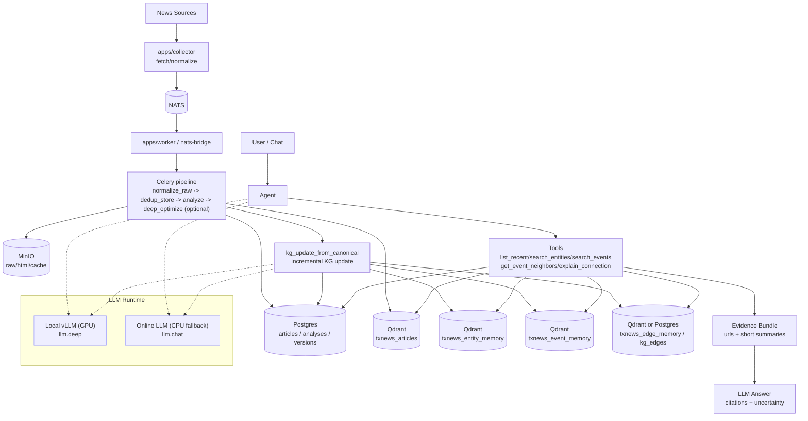
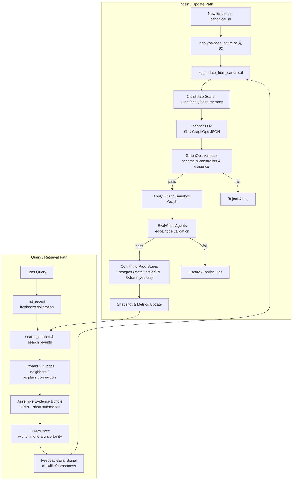

<!-- Input: `docs/V2_NEWS_KG_DESIGN.md` 与 `docs/V2_NEWS_KG_ATTACHMENT_DEV_GUIDE.md` 的 v2 版本设计/里程碑 -->
<!-- Output: 可直接交付的 v2 技术路径与迭代说明（含程序流程框图与数据流图） -->
<!-- Pos: v2 交付路径文档（变更时同步更新以上注释与所属目录 FOLDER.md） -->

# TX-News v2 交付技术路径与迭代说明（News KG / Graph RAG）

补充材料：
- 详细系统设计（schema/存储/在线更新/GraphOps 护栏等）：`docs/V2_NEWS_KG_DESIGN.md`
- 开发者叙事型落地建议（从 v2.0 到 v2.2 的实现侧重点）：`docs/V2_NEWS_KG_ATTACHMENT_DEV_GUIDE.md`

## 1. 交付范围（v2.x）

- v2.0：事件/实体记忆（Event/Entity Memory）最小可用；Chat 从“文章检索”升级为“实体/事件→证据文章”。
- v2.1：事件自连接（Edge as Asset）；支持邻居事件、可解释连接与时效/降噪控制边。
- v2.2：自迭代治理（GraphOps + 合并/拆分/衰减/GC）；引入 sandbox/prod、快照与回滚。
- v2.3（可选）：Claim/Contradiction 节点；支持口径差异/冲突对比与更细粒度推理边。

边界（v2 不做或延后）：
- 不追求严格形式化本体/全图图算法/图神经网络训练；以增量维护的轻量策略为主。
- 不强依赖在线 LLM；CPU 模式允许在线降级，但必须保证规则版可用闭环不断流。

## 2. 数据流图（纵向排版）

## 3. 程序流程框图（保留：Ingest → 演化 → Query → 反馈闭环）

## 4. 存储落点与最小 Schema

### 4.1 Qdrant collections（主检索：连续知识）

| collection | 点类型 | 关键 payload 字段（最小） | 备注 |
| --- | --- | --- | --- |
| `txnews_articles` | article | `canonical_id`、`title/abstract`、`published_at`、`source_id/url` | v1 已有 |
| `txnews_entity_memory` | entity | `entity_id`、`entity_type`、`name/aliases`、`description_text`、`updated_at` | v2.0 起 |
| `txnews_event_memory` | event_snapshot | `event_id`、`snapshot_id`、`snapshot_text`、`canonical_ids`、`last_published_at`、`updated_at` | v2.0 起 |
| `txnews_edge_memory`（可选） | edge_node | `src/dst`、`relation`、`weight/confidence`、`reason_text`、`evidence_ids` | v2.1 起 |
| `txnews_claims`（可选） | claim | `claim_id`、`triple/claim_text`、`confidence`、`evidence_ids` | v2.3 起 |

### 4.2 Postgres tables（最小索引：审计/回滚/治理）

| table | 用途 | 最小字段建议 |
| --- | --- | --- |
| `kg_events` | 事件索引 | `event_id`、`latest_snapshot_id`、`updated_at`、`articles_count`、`last_published_at` |
| `kg_event_snapshots` | 快照版本 | `snapshot_id`、`event_id`、`snapshot_text`、`updated_at`、`embedding_ref`、`canonical_ids` |
| `kg_edges` | 边索引（可视化/治理） | `event_a`、`event_b`、`relation_type`、`weight`、`confidence`、`updated_at`、`evidence_canonical_ids` |
| `kg_ops_log`（建议） | GraphOps 审计 | `op_id`、`run_id`、`ops_json`、`validator_result`、`status`、`created_at` |

说明：
- Chat 主召回以 Qdrant 为主；Postgres 侧用于审计、可视化、治理任务与回滚锚点。
- `embedding_ref` 采用“可定位”的引用（例如 `qdrant:collection:point_id`），避免把向量或大文本重复存两份。

## 5. 在线增量更新：接入点与算法约束

### 5.1 接入点（沿用现有 Celery 链路）

链路基线（v1）：`dedup_store → analyze → deep_optimize（可选）`

v2 接入：在 `analyze/deep_optimize` 之后追加
- `kg_update_from_canonical(canonical_id)`：分钟级增量更新（节点 + 边 + 控制信息）。

### 5.2 节点：EntityMemory / EventSnapshot（v2.0 必须可用）

EntityMemory（规则版即可）：
- 输入：`analyses.data.entities/tickers`（v1 已产出）。
- 输出：`description_text`（1~2KB），建议结构：`name/aliases + 关键属性 + 近期 event_id/标题索引`。

EventSnapshot（规则版必须可用；LLM 增强可选）：
- 输入：同一 `event_id` 的最近 M 篇文章（按 `published_at` 降序）。
- 规则版 `snapshot_text`（1~2KB）：`事件类型 + 关键实体 + 近 M 篇要点(标题/analysis 摘要) + 影响方向占位 + 风险/不确定性模板 + 证据 URL 列表`。
- payload 必带：`canonical_ids`、`last_published_at`、`updated_at`、`event_type/key_entity`、`snapshot_id`。

### 5.3 边：semantic / temporal / control（v2.1）

候选边来源（增量可维护）：
- semantic：`event_snapshot → event_snapshot: related_to`（event_memory TopK，过滤同 event_id）。
- mentions：`event/article → entity: mentions`（来自 v1 抽取结果）。
- temporal：`event_snapshot(t) → event_snapshot(t+1): evolves_to`（按更新时间与证据集合变更）。
- control：`retrieval_priority/ignore`（时效/权威/重复转载降噪）。

权重建议（示例）：
- `weight = sim * recency_decay * entity_overlap_bonus`
- `recency_decay = exp(-Δt/τ)`（τ 可按 `event_type` 配置），确保 Fresh-First。

### 5.4 GraphOps（v2.2）：计划-执行分离 + sandbox/prod

约束：
- LLM 不直接写库；唯一可执行输出为 GraphOps JSON（`UPSERT_NODE/ADD_EDGE/WEAKEN_EDGE/REWIRE/...`）。
- 写入前必须校验：schema、relation 合法、最大度数/跳数、reasoning 边无环、证据存在。
- 默认 sandbox 试运行；Critic/Eval 通过后才 commit 到 prod，并生成快照与可回滚点。

## 6. Query/Chat：工具面与检索策略（Fresh-First）

新增工具（与 `apps/api`/Agent 对齐）：
- `search_entities(q, limit)`：实体记忆检索（Query→Entity 去漂移）。
- `search_events(q, limit, recent_hours)`：事件快照检索（返回 `event_id/snapshot/关键实体/证据 URL`）。
- `get_event_neighbors(event_id, limit)`：邻居事件与关系解释（默认 1 跳；必要时允许 2 跳）。
- `explain_connection(event_a, event_b)`：输出连接理由（reason_text）与 evidence 列表。

检索固定策略（避免旧相似内容长期占优）：
- 强制 `list_recent` 做新鲜度校准（分钟级窗口）。
- 事件召回排序引入 `recency_decay`；多跳扩展最多 1~2 hops。
- 证据输出仅包含 URL + 短摘要；不返回原文长段。

## 7. 迭代拆分与交付清单

### 7.1 v2.0（最小可用：事件/实体记忆）

交付物：
- 存储：创建 `txnews_event_memory`、`txnews_entity_memory`。
- 任务：`kg_update_from_canonical`（规则版可用）；新新闻进入分钟级产出/更新快照。
- 工具：`search_events`、`search_entities`；Query→Entity→Event 成为主路径。
- 排序：Fresh-First（`list_recent` 校准 + `recency_decay`）。

代码落点（建议）：
- `src/tx_news/kg/`：event/entity memory 生成与 upsert。
- `src/tx_news/tasks/kg.py`：`kg_update_from_canonical`。
- `src/tx_news/agent/tools.py`：新增工具与返回结构（证据 URL）。

验收标准（DoD）：
- 对任一新 `canonical_id`：`event_memory` 在分钟级出现可检索快照，payload 含 `canonical_ids/last_published_at/updated_at`。
- Chat 输出：先命中实体/事件，再落到文章 URL 证据；同类旧事件不会在排序中长期置顶。
- CPU 模式：不依赖本地 vLLM 仍可跑通（规则版快照）。

回滚/降级：
- `kg_update_from_canonical` 失败不阻断 v1 入库与文章检索；工具侧可只返回 v1 `search_news` 结果。

### 7.2 v2.1（事件自连接：边作为资产）

交付物：
- 边存储：`txnews_edge_memory` 或 `kg_edges`（二选一或双写）。
- 边生成：基于 `event_snapshot` 相似度 + 实体重叠生成 `related_to`；引入 `retrieval_priority/ignore` 控制边与衰减。
- 工具：`get_event_neighbors`、`explain_connection`（必须返回 reason + evidence）。

验收标准（DoD）：
- 对热门事件：邻居事件可稳定召回；每条边都能回溯 evidence（canonical_id/url）。
- 边权随时间衰减可观测（同一事件在无新证据时，关联排序自然下沉）。

回滚/降级：
- 工具侧可关闭多跳扩展，仅用 v2.0 的 event/entity 召回。

### 7.3 v2.2（自迭代治理：合并/拆分/衰减/GC + GraphOps）

交付物：
- GraphOps：Validator + sandbox/prod + ops_log + snapshot/rollback。
- 周期任务：`kg_reconcile_events()`（合并/拆分）、`kg_gc()`（过期快照/边衰减/归档）。
- 可视化/调试接口：提供 event graph 查询（供 admin 或前端）。

验收标准（DoD）：
- 合并/拆分可回滚、可解释（有 evidence 列表）；变更有审计日志与快照。
- sandbox/prod 隔离生效；线上召回不被 LLM 一次性误操作污染。

### 7.4 v2.3（可选：Claim/Contradiction）

交付物：
- ClaimNode：从事件快照/多篇证据抽取可审计断言，写入 `txnews_claims`。
- 推理边：`supports/refutes/causes`（必须 evidence + 不确定性标注）。
- 对比能力：同一事件不同口径/冲突点聚合展示。

验收标准（DoD）：
- 同一事件多来源：能输出差异点与各自证据 URL；不输出未经证据支持的强因果结论。
