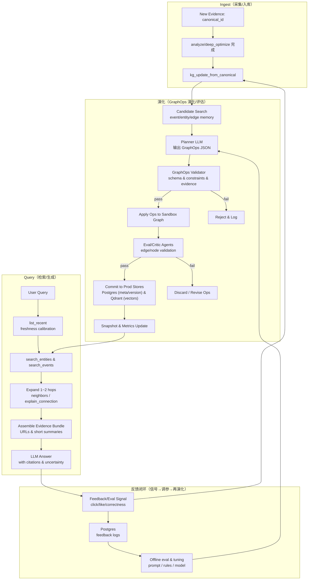

<!-- Input: 现有 TX-News 数据流（collector→worker→Postgres/Qdrant）与 Chat 工具增强对话需求 -->
<!-- Output: v2 自连接自迭代新闻知识图谱（语义连续知识库）系统设计与里程碑（含闭环流程图、GraphOps 规范与通俗实现讲解） -->
<!-- Pos: 版本更新设计文档（变更时同步更新以上注释与所属目录 FOLDER.md） -->

# TX-News v2：自连接自迭代新闻知识图谱（语义连续知识库）设计

本文是“设计稿”，目标是在现有 TX-News v1 的采集/去重/分析/向量检索基础上，构建一个**高时效、可自连接、可自迭代**的新闻知识图谱系统，用于：
1) 发掘新闻事件间的关联与影响路径；2) 面向 Chat 查询提供“证据驱动”的连续知识反馈。

## 0. 现状基线（v1 已有能力）

- **数据流**：`apps/collector` → NATS → `apps/worker`(Celery) → Postgres/Qdrant/MinIO。
- **向量库**：Qdrant 存 canonical 文章向量（`txnews_articles`，维度随 embedding 模型自动兼容 collection）。
- **事件归并**：`tasks/pipeline.analyze()` 通过 `event_type + key_entity + time_window` 生成稳定 `event_id`，可用 `/events/{event_id}` 拉时间线。
- **Chat**：Agent 强制“先工具检索再回答”，当前工具以 `list_recent` + `search_news` 为主（证据来自 Postgres/Qdrant）。

结论：v1 已有“事件中心 RAG”的雏形，但缺少**事件↔事件的长期关联结构**与**随新证据迭代的连续知识载体**。

## 1. 目标与非目标

### 1.1 目标（必须）

- **高时效**：新新闻进入系统后，分钟级可在 Chat 检索与回答中体现（Fresh-First）。
- **自连接**：自动发现并维护 `event↔event`、`event↔entity` 的语义关联，支持“为什么相关/可能的传导链”。
- **自迭代**：随着新证据到来，事件摘要/关系权重可自动更新；支持合并/拆分、漂移修正与过期衰减。
- **连续知识表达**：核心知识以“连续语义空间（embedding + 叙事快照）”表达，避免仅靠离散表结构做拼接。

### 1.2 非目标（v2 不做或延后）

- 不追求严格形式化本体（ontology）或完整因果证明；v2 以“可解释的语义关联 + 证据”优先。
- 不强依赖在线 LLM；LLM 不可用时仍能用规则/向量方法给出可用关联（质量降级但不断流）。
- 不在 v2 直接做复杂图算法（如全图社区发现/图神经网络训练）；先做可增量维护的轻量策略。

### 1.3 Graph RAG 核心思想（适配本项目）

- **节点（Node）**：可被检索、可被引用、可被生成的知识单元（本质是“文本载体 + embedding + 元数据”）。
- **边（Edge）**：控制检索路径、上下文拼接、时序演化、因果/逻辑约束的结构信息（本质是“可解释的连接 + 权重/置信度 + 证据”）。

本项目的约束与取舍：
- **连续知识优先**：主知识形态落在 Qdrant（向量 + payload），而不是依赖大量离散表 join；Postgres 仅作为审计/回滚/可视化的最小索引。
- **时效优先**：边与检索排序必须显式引入时间衰减与“近时校准”（Fresh-First），避免向量近邻把旧相似内容拉上来。
- **可解释优先**：任何关系边都必须能回溯到 `canonical_id/url` 证据集合；边的“原因文本”本身也可向量化以辅助解释检索。

## 2. Graph RAG Schema：把“图”做成可迭代的语义记忆

### 2.1 节点（Nodes）：本项目需要的知识单元

v2 的节点遵循统一思想：每个节点都要有“可引用的文本载体”，让它既能被检索召回、也能在回答中作为证据/摘要被引用。

#### (1) Document / Chunk（文章/片段）节点：`ArticleNode`

- **对应现状**：canonical 文章已存在（Postgres `articles` + Qdrant `txnews_articles`）。
- **典型字段（payload）**：
  - `node_type: "article" | "chunk"`（v2 初期可先只做 article）
  - `canonical_id`（稳定 id）
  - `text`（不建议在 Qdrant 存全文；可存 title + short abstract）
  - `embedding`（已存在）
  - `source_id/url/published_at/fetched_at`
  - `quality_score`（可选：去重置信、媒体权重等）
- **作用**：向量检索入口 + 证据链接落点。

#### (2) Entity（实体）节点：`EntityNode`

- **对应现状**：已有 ticker 匹配 + `/entities/{ts_code}` 主数据；但还缺“可检索的实体记忆文本”。
- **实体类型建议**：
  - `ticker/company`（A 股 ts_code 为主键）
  - `org`（机构/监管部门/协会）
  - `concept/industry/macro`（行业链、宏观概念、政策名）
- **典型字段**：
  - `node_type: "entity"`
  - `entity_id`（`ts_code` 或 `sha256(entity_type|name)`）
  - `entity_type`、`name`、`aliases`
  - `description_text`（短：公司简介/行业/别名/关键属性/近期事件引用）
  - `embedding`
- **作用**：减少“语义漂移”（query→entity→event 的桥接），并作为多跳扩展的锚点。

#### (3) Event（事件）节点：`EventNode`（事件级可迭代记忆）

- **对应现状**：已有 `event_id`（由 `event_type + key_entity + time_window` 生成）。
- v2 增强为“事件记忆快照（Summary/State）序列”，每次更新都会产出一个可检索的短文本载体：
  - `snapshot_text`：发生了什么 + 关键实体 + 可能传导路径 + 不确定性 + 证据 URL 列表（压缩到 1～2KB）
  - `snapshot_embedding`：对 `snapshot_text` 的 embedding（用于 event-level 检索与 event↔event 连接）
  - `snapshot_meta`：`updated_at`、覆盖窗口、纳入的 canonical_ids、来源分布、`last_published_at`
- **保留策略**：只保留最近 N 个快照（例如 N=24），体现“连续演化”且便于衰减/归档。

#### (4) Fact / Claim（事实/断言）节点：`ClaimNode`（v2.3 起但可提前留口）

- **来源**：
  - 规则版：从 `analyses.data` 中结构化字段模板化生成（例如“X 公司发布业绩预告，影响方向为 …”）。
  - LLM 增强：从多篇证据中抽取“可审计断言”（必须附 evidence）。
- **典型字段**：
  - `node_type: "claim"`
  - `claim_id`（`sha256(subject|predicate|object|event_id|window_start)`）
  - `subject/predicate/object`（或 `claim_text`）
  - `confidence`
  - `evidence_canonical_ids`
- **作用**：把“图的推理边”落到可审计证据链上（supports/refutes/causes）。

#### (5) Query / Task（查询/任务）节点：`QueryNode`（不一定持久化）

- **定位**：每次 Chat 请求的临时节点（可选做短期缓存），包含 `query_text/intent/constraints`。
- **作用**：驱动“动态子图构建”（先找实体→找事件→找证据）。

#### (6) State / Memory（状态/记忆）节点：`StateNode`

- **定位**：事件记忆本质就是 StateNode 的一种；也可扩展为“市场状态/舆情状态/政策预期状态”。
- **作用**：支持自迭代闭环（新证据到来→状态更新→边权调整→检索路径改变）。

### 2.2 边（Edges）：本项目需要的连接类型

边决定“能不能走、走多远、用什么拼上下文、如何保证时效/可信”。建议先做可增量维护、成本可控的边类型：

#### (1) 语义关系边（semantic）

- `article → entity: mentions`（由 ticker/实体识别得到）
- `event_snapshot → event_snapshot: related_to`（由 event_memory 向量近邻得到）
- `entity → entity: related_to`（行业/概念/同一事件共现）

字段：`relation/weight`（`weight` 可来自 cosine similarity + 实体重叠 bonus）。

#### (2) 结构关系边（structural / hierarchy）

- `chunk → article: part_of`
- `event_snapshot → event: summarizes`
- `claim → event: belongs_to`

字段：`relation`（通常不需要 weight）。

#### (3) 逻辑/推理边（reasoning）

- `claim → claim: supports | refutes`
- `event → event: causes | implies`（只在有足够证据与不确定性约束下生成）

字段：`relation/confidence/evidence`（必须带证据 canonical_ids；可选附“原因文本”）。

#### (4) 时间/演化边（temporal）

- `event_snapshot(t) → event_snapshot(t+1): evolves_to`
- `event_a → event_b: before | after`（基于 `published_at` 与窗口）

字段：`timestamp`（或 `source_time/target_time`）。

#### (5) 检索与控制边（control，LLM-aware）

用于把“时效性/可信度/降噪”显式注入检索路径（这是新闻场景的关键）：

- `event_snapshot → *: retrieval_priority`（近时/权威来源/高置信边权提升）
- `* → *: ignore`（低质量源、重复转载、旧事件在新窗口内降权）

字段：`weight`（可随时间衰减）、`reason`（为什么 boost/ignore）。

### 2.3 极简 Schema（通用、可落地）

节点（Node）最小字段：
- `id`
- `node_type`
- `text`（或 `name/description_text`）
- `embedding`（或 `embedding_ref`）
- `metadata`（`timestamp/source/confidence/quality_score/...`）

边（Edge）最小字段：
- `source_id`
- `target_id`
- `edge_type`
- `relation`
- `weight`（可选）
- `confidence`（可选）
- `evidence_ids`（建议：`canonical_id` 列表）

## 3. 存储与索引（连续知识优先）

### 3.1 Qdrant：主检索与“连续语义空间”

建议以“节点可检索”为第一原则组织 collection；边可先走轻量实现（Postgres 表或 Qdrant edge_memory 二选一）。

建议新增/拆分 collection（与现有 embedding 维度兼容策略保持一致）：

- `txnews_articles`：文章向量（已存在）。
- `txnews_event_memory`：事件快照/摘要向量（Summary/State 节点；payload 含 `event_id`、`snapshot_id`、`updated_at`、`canonical_ids`、`last_published_at`）。
- `txnews_entity_memory`：实体记忆向量（Entity 节点；payload 含 `entity_id/entity_type/name/aliases`）。
- `txnews_claims`（可选）：断言向量（Claim 节点；payload 含 `claim_id/subject/predicate/object/confidence/evidence_ids`）。
- `txnews_edge_memory`（可选）：把“边”也做成可检索对象（EdgeNode：relation explanation text + embedding + `source_id/target_id/weight/evidence_ids`），用于“解释为什么相关”。

### 3.2 Postgres：最小化的“可回滚与可解释”元数据（可选但推荐）

为避免“图结构完全埋在 payload”导致难以治理，建议在 Postgres 存 **最小索引**：

- `kg_events`：`event_id`、`latest_snapshot_id`、`updated_at`、统计字段（articles_count、last_published_at）。
- `kg_event_snapshots`：`snapshot_id`、`event_id`、`snapshot_text`、`updated_at`、`embedding_ref`（指向 Qdrant point）。
- `kg_edges`：`event_a`、`event_b`、`relation_type`、`weight`、`updated_at`、`evidence_canonical_ids`（少量即可）。

注意：Chat 的主召回仍以 Qdrant 为主；Postgres 表仅用于审计、可视化与一致性维护。

## 4. 在线更新（自连接/自迭代）流水线

### 4.1 触发点：沿用现有 Celery 任务链

在 v1 的 `dedup_store → analyze → deep_optimize` 后新增一个任务：

- `kg_update_from_canonical(canonical_id)`：增量更新 Graph RAG 子图（节点 + 边），面向“分钟级可用”的时效要求。

建议该任务一次性完成（不强依赖 LLM）：
- **节点**：upsert `EntityNode`（实体记忆）、`EventNode snapshot`（事件快照），可选 upsert `ClaimNode`（断言）。
- **边**：upsert `mentions/related_to/evolves_to/retrieval_priority` 等边（或等价写入 edge_memory/edges 表）。
- **控制**：对边权/检索排序注入 `recency_decay` 与 `quality_score`（权威源/重复转载降噪）。

### 4.2 节点更新（Entity/Event/Claim）

输入：`canonical_id` 对应的（title、analysis、published_at、tickers、event_id）。

#### 4.2.1 实体记忆更新（EntityNode）

- 以 `analyses.data.entities/tickers` 为主来源（v1 已产生），把“实体”变成可检索的短文本记忆：
  - 公司：`ts_code + name + industry + aliases + 近期事件引用（event_id 列表）`
  - 机构/概念：`name + aliases + 近期高频共现实体/事件`
- embedding 后 upsert 到 `txnews_entity_memory`（不存原文，只存简介/链接）。

#### 4.2.2 事件快照更新（EventNode Snapshot，自迭代）

过程（优先无 LLM 可运行；LLM 仅做增强润色/纠错）：

1) 取该 `event_id` 的最近 M 篇文章（可通过 analyses.data.event_id + 时间排序）。
2) 生成 `snapshot_text`（建议 1～2KB 内）：
   - 规则版：拼装“事件类型 + 关键实体 + 近 M 篇标题摘要 + 影响方向占位 + 风险/不确定性模板 + 证据 URL”。
   - LLM 增强版（可选）：在规则版基础上进行压缩与纠错，产出更稳定的叙事。
3) 对 `snapshot_text` 做 embedding，upsert 到 `txnews_event_memory`。
4) 在 payload 中写入：`canonical_ids`（证据集合）、`last_published_at`、`updated_at`、`event_type/key_entity`，并更新 `kg_events.latest_snapshot_id`（或 payload 内 `latest=true` 标记）。

输出：可被 `search_events` 工具直接检索的“事件级证据面板”。

#### 4.2.3 断言节点更新（ClaimNode，可选）

- v2 初期可先不落地 ClaimNode；但建议在 schema 中预留：
  - 规则版：把 `impact/index_view/event_type` 模板化为 1～3 条短断言（必须带证据 canonical_ids）。
  - LLM 增强：从事件快照 + 多篇证据中抽取“可审计断言”（supports/refutes/causes），仍需 evidence。

### 4.3 边更新（semantic / temporal / control / reasoning）

对每次新快照，构建并维护“可增量更新”的边集合：

- **semantic（相关性）**：
  - `event_snapshot → event_snapshot: related_to`：在 `txnews_event_memory` 里检索 TopK（如 K=20），过滤同 event_id。
  - `article → entity: mentions`、`event → entity: mentions`：来自 v1 识别结果（tickers/entities）。
  - `entity → event: related_to`：entity 近期被哪些 event 覆盖（可用倒排索引或简单统计）。
- **temporal（演化）**：`event_snapshot(t) → event_snapshot(t+1): evolves_to`（按更新时间/证据集合变更）。
- **control（时效/降噪）**：对任意可扩展边写入 `retrieval_priority/ignore`：
  - 近时 boost：`recency_decay = exp(-Δt/τ)`（τ 可按 event_type 配置）。
  - 权威 boost：媒体源权重/重复转载降权（可从 source_id 做白/灰名单）。
- **reasoning（推理，可选）**：仅在 ClaimNode 存在时启用 `supports/refutes/causes`，并强制 evidence。

对候选边计算权重（示例）：

`weight = sim * recency_decay * entity_overlap_bonus`

其中 `recency_decay = exp(-Δt / τ)`（τ 可按 event_type 或全局设置），确保**时效性**：旧事件不会长期主导检索。

将边写入：
- Qdrant（`txnews_edge_memory`，便于“关系解释检索”）；以及/或者
- Postgres（`kg_edges`，便于可视化与治理）。

### 4.4 合并/拆分与漂移修正（自迭代的关键，v2.2 起）

提供周期性维护任务（例如每 10 分钟/每小时）：

- `kg_reconcile_events()`：
  - 合并：两个 event_id 的快照长期高度相似 + 实体高度重叠 → 生成 merge 记录与 alias。
  - 拆分：同一 event_id 内快照语义出现明显双峰/漂移 → 拆分为 event_id2（保留历史映射）。

合并/拆分不追求完美，但必须满足：可回滚、可解释（给出证据 canonical_ids）。

### 4.5 自动迭代功能：图生命周期系统（可落地）

你要的不是“静态图”，而是一个可持续运行的 **Graph Lifecycle System**，满足两条硬约束：
- **Node**：可增量迭代（versioned rewrite）+ 可过期删除（decay/ttl + GC）。
- **Edge**：由 LLM 驱动生成与验证，作为“可检验假设（hypothesis）”可重连、可演化。

并且遵守工程护栏：
- **LLM 不直接写数据库**：LLM 只能输出结构化 `GraphOp JSON`；由执行层校验后落库。
- **双图机制（Sandbox/Prod）**：LLM 在 sandbox 试错；通过评估/校验后再 commit 到 prod。
- **快照与回滚**：任何一次 commit 前后可保存 snapshot，出错可回滚。
- **本地 vLLM 优先**：图构建/迭代相关的 Planner/Critic/Rewire 默认走本地 vLLM；CPU 模式自动降级到在线 LLM（见 4.5.6）。

#### 4.5.1 NodeStore（版本化 + 时间属性 + 逻辑删除）

建议把“节点元数据/版本/状态”落 Postgres，把“节点可检索向量”落 Qdrant（符合本项目“连续知识优先”）。

Node 记录（示意）：
```json
{
  "node_id": "entity:600519.SH",
  "node_type": "entity|event_snapshot|claim|article",
  "content": "可引用短文本（1~2KB）",
  "embedding_ref": "qdrant:txnews_entity_memory:...",
  "version": 3,
  "created_at": "2026-01-01T00:00:00Z",
  "last_updated": "2026-01-10T00:00:00Z",
  "ttl_days": 90,
  "decay_score": 0.42,
  "status": "active|deprecated|archived",
  "meta": {"source":"...", "evidence_ids":["..."], "quality_score":0.8}
}
```

Node 增量迭代（LLM-driven rewrite）的最小闭环：
1) `candidate_search`：对新证据/新文本向量检索候选节点（同类节点内 TopK）。
2) `planner_llm`：基于“旧节点 + 新证据”输出动作：`UPDATE|MERGE|DEPRECATE|CREATE`。
3) `executor`：校验动作合法性（schema/证据/约束），写入 sandbox。
4) `eval_agent`：抽样或按阈值验证（例如一致性、引用证据是否存在、是否违反合规）。
5) `commit`：通过则写入 prod，并生成新版本（`version+1`）。

#### 4.5.2 Node 过期删除（Decay + Lazy GC）

三层机制同时启用（缺一不可）：
- **时间衰减**：`decay_time = exp(-(now - last_updated)/τ)`
- **使用频率衰减**：`decay_usage = f(retrieval_count, last_retrieved_at)`（越少检索越衰减）
- **语义被覆盖**：新版本节点覆盖旧节点 → 旧节点 `deprecated`

执行方式：
- **Lazy deletion**：检索阶段过滤 `status != active` 或 `decay_score < θ` 的节点。
- **Periodic GC job**：定期把 `deprecated` 且超过窗口的节点标记为 `archived`，并可选择从 Qdrant 删除向量 point（物理删除可延后）。

#### 4.5.3 EdgeStore（边 = 假设，可被否定、可重连）

边不是静态“事实”，而是可检验的推理假设（Hypothesis）。边记录（示意）：
```json
{
  "edge_id": "e123",
  "src": "event:...",
  "dst": "event:...",
  "edge_type": "semantic|temporal|control|reasoning",
  "relation": "related_to|mentions|evolves_to|supports|refutes|causes|retrieval_priority|ignore",
  "weight": 0.71,
  "confidence": 0.61,
  "evidence_ids": ["canonical_id_1", "canonical_id_2"],
  "created_by": "llm",
  "status": "active|weakened|removed",
  "last_validated": "2026-01-08T00:00:00Z",
  "meta": {"reason_text":"为什么这样连（短）", "decay_tau_hours":72}
}
```

边的 LLM 驱动演化（MVP 三代理）：
- **Edge Proposal Agent**：在新证据/新快照到来时，提出候选边（ADD/UPDATE）。
- **Edge Critic Agent**：破坏式验证边是否仍成立（KEEP/WEAKEN/REMOVE），必须引用证据集合。
- **Edge Rewiring Agent**：当边置信下降或出现更优路径时，提出“重连”方案（REMOVE 旧边 + ADD 新路径边）。

注意：reasoning 类边（`causes/supports/refutes`）只允许在 evidence 足够且包含不确定性标注时进入 prod。

#### 4.5.4 GraphOps DSL（强制护栏：计划-执行分离）

LLM 输出的唯一可执行物是 GraphOps JSON（示意）：
```json
{
  "ops": [
    {"op":"UPSERT_NODE","node_id":"event_snapshot:...","node_type":"event_snapshot","content":"...","ttl_days":30},
    {"op":"ADD_EDGE","src":"event:...","dst":"event:...","edge_type":"semantic","relation":"related_to","weight":0.73,"confidence":0.58,"evidence_ids":["..."]},
    {"op":"WEAKEN_EDGE","edge_id":"e123","confidence":0.41,"reason":"new evidence contradicts"},
    {"op":"REWIRE","remove_edge_ids":["e123"],"add_edges":[{"src":"A","dst":"D","relation":"supports"}, {"src":"D","dst":"B","relation":"supports"}]}
  ],
  "constraints": {"max_degree": 12, "max_hops": 2, "evidence_required": true, "acyclic_reasoning": true},
  "target": "sandbox"
}
```

执行层必须做：
- JSON schema 校验（字段齐全、类型正确、relation 合法）。
- 约束校验（最大出入度、最大跳数、reasoning 边禁止形成环、证据必须存在于 articles/versions）。
- 风险控制（一次 commit 的 ops 数量上限、同一节点/边的修改频率限制）。

##### 4.5.4.1 程序化演化流程（可直接落地的操作步骤）

以“新证据 canonical_id 到来”为触发，图演化程序的**唯一入口**可以抽象为：

`kg_update_from_canonical(canonical_id) -> (sandbox_plan, eval_report, commit_result)`

其程序操作流程（建议按顺序，不要省略护栏）：
1) **Load evidence**：从 Postgres 拉取该 `canonical_id` 的规范化结果（title/url/published_at/text 摘要、entities、event_id 候选、已有分析版本等），并构造 `evidence_items[]`（见 4.5.4.2）。
2) **Candidate retrieval**（只取 TopK，控制成本）：
   - event/entity：Qdrant 从 `txnews_event_memory`/`txnews_entity_memory` 召回 TopK；Postgres 回表补齐版本与状态。
   - edge：从 `txnews_edge_memory` 或 `kg_edges` 拉与候选 event 相关的出入边（限制窗口与数量）。
3) **Assemble LLM input**：把“新证据 + 候选子图 + 系统约束”打包成 `GraphOpsRequest` JSON，作为 Planner LLM 的唯一输入（见 4.5.4.2、4.5.4.3）。
4) **Planner LLM**：输出 `GraphOpsPlan`（只允许 JSON、只允许引用输入里给出的 `canonical_id` 作为证据）。
5) **Validate**（强制）：
   - JSON 解析 + schema 校验（字段、类型、枚举、必填）。
   - 证据校验：`evidence_ids` 必须是输入 `evidence_items[].canonical_id` 的子集；不得编造。
   - 图约束校验：max_degree、reasoning 边不成环、禁止跨类型乱连、同一对节点边数量上限等。
   - 风险门控：高风险操作（批量删除/大规模重连/大范围降置信）→ 自动 `requires_human_review=true`，只写 sandbox。
6) **Apply to sandbox**：把 ops 写入 sandbox（可以是 Postgres 表 `kg_*_sandbox` + Qdrant sandbox collection；或同库用 `graph_env=sandbox` 分区/字段隔离）。
7) **Critic/Eval**：对 sandbox 变更做破坏式评估（LLM Critic + 规则校验 + 离线指标），输出 `EvalReport`（见 4.5.4.4）。
8) **Commit**：仅当 Eval 达标且风险门控允许时，将 sandbox 变更“原子化”提交到 prod（版本号 +1，保留回滚快照），并写入审计日志（谁触发、引用哪些证据、改了什么）。
9) **Index/metrics refresh**：更新 Qdrant payload、检索缓存、统计指标（例如边/节点活跃度、检索命中率、反馈质量）。

可行性要点：
- 所有 LLM 输出都被限制为“计划（plan）”，执行与提交由程序负责；因此不会出现“LLM 直接写库”的不可控风险。
- 所有输入都来自检索 TopK 的小子图；成本与延迟可控，且可在 LLM 不可用时降级为规则/向量策略（仍可写入 minimal 边与版本元数据）。

##### 4.5.4.2 Planner 的输入格式（GraphOpsRequest）

Planner 的输入应当是**严格 JSON**（不要拼自然语言大段上下文），建议结构如下（字段可以用 Pydantic/JSON Schema 固化）：
```json
{
  "request_id": "uuid",
  "trigger": {"canonical_id": "c_...", "reason": "new_evidence"},
  "now": "2026-01-10T00:00:00Z",
  "policy": {
    "target": "sandbox",
    "max_ops": 20,
    "max_degree": 12,
    "max_hops": 2,
    "evidence_required": true,
    "acyclic_reasoning": true,
    "allow_relations": ["related_to", "evolves_to", "supports", "refutes", "causes"],
    "min_confidence_to_add": 0.55
  },
  "evidence_items": [
    {
      "canonical_id": "c_...",
      "published_at": "2026-01-10T00:00:00Z",
      "title": "...",
      "url": "...",
      "summary": "≤ 1200 字的规范化摘要/关键信息（可含要点列表）",
      "entities": [{"id": "entity:...", "name": "...", "type": "org|person|place|ticker"}],
      "signals": {"event_id_hint": "event:...", "source_quality": 0.7}
    }
  ],
  "candidate_subgraph": {
    "nodes": [
      {
        "node_id": "event:...",
        "node_type": "event|entity|event_snapshot",
        "version": 3,
        "status": "active",
        "content": "可引用短文本（用于检索/解释）",
        "last_updated": "2026-01-08T00:00:00Z"
      }
    ],
    "edges": [
      {
        "edge_id": "e123",
        "src": "event:...",
        "dst": "event:...",
        "relation": "related_to",
        "weight": 0.71,
        "confidence": 0.61,
        "evidence_ids": ["c_old_1"]
      }
    ]
  },
  "expected_outputs": {
    "ops_json_only": true,
    "require_evidence_ids": true,
    "node_content_max_chars": 2000,
    "reason_text_max_chars": 240
  }
}
```

输入设计的关键点（保证“合理可行有效”）：
- **证据是列表**：Planner 只能引用 `evidence_items[].canonical_id`，杜绝“凭空引用”。
- **子图是 TopK**：LLM 永远在“小子图”里工作；复杂度与成本可控。
- **policy 显式化**：把约束写进输入，Validator 也按同一份 policy 做二次校验，避免“提示词说了但代码没管”。

##### 4.5.4.3 Planner Prompt（模板，可直接用于 vLLM/OpenAI 兼容 Chat API）

推荐把 prompt 分成两段：system 固化护栏，user 只塞 `GraphOpsRequest` JSON。

System（示意，保持短而硬）：
```text
你是 GraphOps Planner。你只能输出严格 JSON，不能输出 Markdown/解释文字。
你不能编造证据 canonical_id；evidence_ids 必须来自输入 evidence_items[].canonical_id。
你不能直接写数据库；你的输出只是待验证的计划（target 固定为 sandbox）。
如果信息不足，输出最小变更计划：ops=[] 并在 summary 标注缺失项。
```

User：
```text
根据以下 GraphOpsRequest JSON 生成 GraphOpsPlan JSON（只输出 JSON）：
{{GRAPH_OPS_REQUEST_JSON}}
```

Planner 输出（GraphOpsPlan）建议包含“可执行 ops + 摘要 + 风险标记”：
```json
{
  "target": "sandbox",
  "summary": "用 1~3 句描述这次改图的核心意图",
  "requires_human_review": false,
  "ops": [
    {
      "op": "UPSERT_NODE",
      "node_id": "event_snapshot:...",
      "node_type": "event_snapshot",
      "content": "≤2000 chars",
      "ttl_days": 30,
      "evidence_ids": ["c_..."]
    },
    {
      "op": "ADD_EDGE",
      "src": "event:...",
      "dst": "event:...",
      "edge_type": "semantic",
      "relation": "related_to",
      "weight": 0.73,
      "confidence": 0.58,
      "evidence_ids": ["c_..."],
      "reason_text": "≤240 chars"
    }
  ]
}
```

实现建议（让系统更稳、更像工程而不是“对话”）：
- 输出 JSON 用“单一对象”而不是多段；服务端直接 `json.loads()` + schema 校验。
- 对 `weight/confidence` 设定范围与默认：`0.0~1.0`，缺失则 Validator 拒绝（防止模型漏字段导致隐式默认）。
- `requires_human_review` 用于接住模型“想做大动作”的冲动：例如一次性 `REMOVE_EDGE` 超过阈值、或重连涉及高影响节点时强制人工确认。

##### 4.5.4.4 Critic/Eval：输入输出与 Prompt（破坏式验证）

Critic 的目标不是“写新计划”，而是对 sandbox 变更做**最苛刻的反证**：证据是否真支持？有没有更简单解释？有没有误连？输出必须可机读。

Critic 输入（建议同样用严格 JSON）：
```json
{
  "request_id": "uuid",
  "trigger": {"canonical_id": "c_..."},
  "plan": { "...": "GraphOpsPlan 原样" },
  "sandbox_diff": {
    "added_nodes": [{"node_id": "...", "content": "..."}],
    "added_edges": [{"src": "...", "dst": "...", "relation": "...", "evidence_ids": ["c_..."]}],
    "updated_edges": [{"edge_id": "e123", "confidence_before": 0.61, "confidence_after": 0.41}]
  },
  "evidence_items": [ { "...": "同 Planner 输入" } ],
  "policy": { "...": "同 Planner 输入" }
}
```

Critic system prompt（示意）：
```text
你是 GraphOps Critic。你只输出严格 JSON。
你的任务是找出计划中最可能错误的点：证据不足/误连/方向错误/过度推理/违反约束。
对每条新增或更新的边，给出 verdict=KEEP|WEAKEN|REMOVE，以及理由与置信度(0~1)。
若发现 reasoning 边形成环或证据不足，必须判定 REMOVE 或 requires_human_review=true。
```

Critic 输出（EvalReport）：
```json
{
  "requires_human_review": false,
  "verdict": "pass",
  "edge_reviews": [
    {
      "edge_key": {"src": "event:...", "dst": "event:...", "relation": "related_to"},
      "verdict": "KEEP",
      "confidence": 0.72,
      "reasons": ["证据 c_... 明确提及 ...", "与候选子图一致"]
    }
  ],
  "global_risks": ["可能存在实体同名歧义：..."],
  "suggested_fixes": [
    {"op": "WEAKEN_EDGE", "edge_id": "e123", "confidence": 0.45, "reason": "证据不足"}
  ]
}
```

为什么这样有效：
- Planner 负责“生成假设”，Critic 负责“否定假设”；两者目标相反，更容易降低幻觉带来的误连。
- EvalReport 是机读结构，可以直接驱动下一步：pass→commit；fail→discard；pass 但有 fixes→先把 fixes 应用到 sandbox 再重评。

##### 4.5.4.5 Validator/Executor 细则（幂等、版本、回滚、可审计）

为了保证“合理可行有效”，执行层需要把不确定性关在几个确定的地方：

**(A) GraphOps op 白名单（其余一律拒绝）**
- Node：`UPSERT_NODE`、`DEPRECATE_NODE`
- Edge：`ADD_EDGE`、`UPDATE_EDGE`、`WEAKEN_EDGE`、`REMOVE_EDGE`
- 组合：`REWIRE`（等价于一组 REMOVE + ADD，但必须显式列出受影响边）

**(B) ID 与幂等（避免重复写入与抖动）**
- `edge_id` 建议由执行层生成：`uuid5(NAMESPACE, f\"{src}|{dst}|{relation}|{edge_type}\")`，LLM 不提供也可。
- `node_id` 若是从证据派生（如 event_snapshot/claim），也建议执行层生成确定性 id：`uuid5(NAMESPACE, f\"{node_type}|{canonical_id}|{version_tag}\")`。
- 对同一 `canonical_id` 的重复触发必须幂等：若 plan 产生相同 op，落库应变为“更新 last_updated/metrics”，而不是制造重复节点/边。

**(C) 版本化写入（任何可见内容变化都产生新版本）**
- `UPSERT_NODE` 若 `content` 变化：写入新版本（`version+1`），旧版本标记 `deprecated`，并保留 `superseded_by` 指针。
- `UPDATE_EDGE/WEAKEN_EDGE` 不覆盖历史：写入变更记录（审计表），或把边记录做 versioned（至少保留 `confidence_before/after` 与 evidence 差异）。

**(D) 证据与约束校验（把“可解释”做成硬规则）**
- `evidence_ids` 必须非空（当 `policy.evidence_required=true`）且都存在于输入 evidence_items。
- reasoning 关系（`supports/refutes/causes`）必须满足更高门槛：`confidence >= policy.min_confidence_to_add` 且 evidence 条数 ≥ 2（建议），否则自动降级为 `related_to` 或拒绝。
- 禁止“全图大手术”：单次计划中 `REMOVE_EDGE`/`REWIRE` 的影响数量超过阈值（如 5 条）→ 强制 `requires_human_review=true`，只写 sandbox。

**(E) Sandbox → Prod 的原子提交**
- 提交前生成 snapshot（prod 当前子图快照 + sandbox diff + plan/eval 原文），写入 Postgres 审计表。
- commit 采用事务边界：Postgres 事务提交成功后再写 Qdrant；若 Qdrant 写入失败则记录补偿任务（重试/回滚），避免“半提交”。

**(F) 效果度量（保证“有效”不是口号）**
- 在线：`retrieval_precision@k`、`answer_citation_rate`、`feedback_positive_rate`、`hallucination_reports`。
- 离线：用固定 query 集与回放证据集跑 `before/after` 对比；只允许在指标不回退或可解释的情况下放量启用。

#### 4.5.5 程序流程框图（Ingest → 演化 → Query → 反馈闭环）



#### 4.5.5.1 通俗版：这条“闭环流水线”到底在干什么

可以把它想象成一个“会不断写笔记、会自我纠错的新闻研究员”，每天做四件事：**收材料（Ingest）→写出阶段性结论（演化）→回答提问（Query）→根据反馈改进（反馈闭环）**。核心思路不是“一次性建完图”，而是让图像新闻一样**持续更新、可回滚、可审计**。

**1）Ingest：把新闻变成可追溯的“证据包”**
- 采集器把网页/RSS/API 拉回来，先别急着“理解”，先把原始材料妥善保存（比如 MinIO），确保将来能复盘“这条结论当时依据是什么”。
- Worker 管道做规范化、去重、提取结构化字段，并产出稳定的 `canonical_id`。它就像“每条新闻的身份证”，后续所有演化、检索、反馈都围绕它串起来。
- 同时把两份“底稿”写好：一份是 **Postgres**（元数据/版本/审计日志），一份是 **Qdrant**（向量索引，负责语义召回）。一个管得住、可回滚；一个找得快、找得准。

**2）演化：把证据变成“可执行的改图计划”，再谨慎落地**
- 系统先做候选搜索（从 event/entity/edge memory 里找可能相关的旧知识），把“上下文素材”凑齐。
- 然后让 Planner LLM 只做一件事：输出一份结构化的 **GraphOps JSON**，相当于“改图施工单”（要新增哪些节点/边、要更新哪些摘要/权重、证据引用是什么）。
- 施工单不会直接执行：Validator 会做 schema/约束/证据校验，确保“改动说得清、落得下、能追责”。
- 先落到 Sandbox Graph 里试运行，让 Critic/Eval 再挑刺；通过后才 commit 到生产存储（Postgres 版本 + Qdrant 向量）。这一步的价值是：把“LLM 的创造性”关在护栏里，把线上图的稳定性守住。

**3）Query：回答问题时，先检索证据，再组织叙述**
- 用户提问进入 API 后，先做 freshness 校准（例如 `list_recent`），避免“相关但过时”的信息压过最新进展。
- 再做 hybrid 检索：Qdrant 负责语义召回，Postgres 回表补齐结构化字段与版本信息；必要时扩展 1~2 hops，拿到“为什么相关”的连接解释与邻居证据。
- 最后把证据打包成“可引用的证据束”（URL + 简短摘要 + 不确定性提示），再交给 LLM 生成回答；LLM 的输出应像“有出处的记者稿”，而不是“凭感觉的作文”。

**4）反馈闭环：把用户信号变成下一轮演化的燃料**
- 用户点击/收藏/纠错等反馈会落库成可分析的日志：它不是立刻改图，而是作为“质量信号”进入离线评估与调参。
- 离线评估会反向推动三件事：提示词/规则调优、阈值与权重更新、必要时的模型/向量策略迭代；这些改动再回到 Planner/Evolve 流程里持续生效。

一句话总结：这条闭环流水线的关键不是“画出一张很大很复杂的图”，而是建立一套**可持续演化的机制**：每次只做小步改动、每次都能解释依据、每次都能被反馈牵引着变得更准。

#### 4.5.6 LLM 运行策略（本地 vLLM 优先，CPU 降级在线）

图的构建与演化依赖多代理（Planner/Critic/Rewire），其质量与时效直接决定 Graph RAG 的可用性；因此运行策略明确为：

- **GPU 模式（推荐）**：使用本地 vLLM 作为 KG LLM（优先走 `llm.deep`），完成：
  - `GraphOps Planner`（生成 graph-op JSON）
  - `Edge Critic / Rewiring`（边验证与重连）
  - `Node Rewrite`（节点增量改写与合并/弃用判断）
- **CPU 模式**：不强制本地 vLLM（通常不可用/太慢），统一降级为在线 LLM（走 `llm.chat` 或 `resolve_llm_deep()` 的 CPU 回退逻辑）。
- **GPU 模式下的容灾**：本地 vLLM 失败/超时/不可达时，允许回退到在线 LLM（保持系统不断流，但在输出中增加“不确定性/可能偏差”提示）。

与现有配置的对齐方式：
- `TXNEWS_ACCELERATOR=gpu` 时：`llm.deep.base_url` 指向本地 vLLM（例如 `http://127.0.0.1:9999/v1`），可不配置 api_key。
- `TXNEWS_ACCELERATOR=cpu` 时：`resolve_llm_deep()` 自动回退到 `llm.chat`（即在线 LLM），用于所有 KG 相关 LLM 调用。

## 5. 查询与 Chat 反馈：从“文章检索”升级为“事件记忆 + 关系路径”

### 5.1 工具层新增（Agent Tools）

新增工具（示例）：

- `search_events(q, limit, recent_hours)`：检索事件快照（而非直接检索文章），返回 event_id、摘要、关键实体、证据 URL。
- `search_entities(q, limit)`：检索实体记忆（entity_memory），用于 query→entity→event 的桥接与去漂移。
- `get_event_neighbors(event_id, limit)`：返回与该事件最相关的邻居事件及关系解释（优先带证据）。
- `get_entity_events(entity_id, limit)`：从实体桥接到相关事件（“公司/行业最近发生了什么”）。
- `explain_connection(event_a, event_b)`：若存在 edge_memory/edges，输出可解释的连接理由与证据集合。

### 5.2 Fresh-First（保证时效性）

Agent（Graph RAG）策略固定为（Query Node → 子图 → 证据 → 生成）：

1) 先 `list_recent(minutes=...)` 获取近时证据（无论用户问什么都做一次“新鲜度校准”）。
2) 为 query 建立临时 `QueryNode`（可不持久化），并执行：
   - `search_entities(q)`（先锁定实体，减少语义漂移）
   - `search_events(q)`（召回事件快照）
3) 多跳扩展（最多 1～2 跳，避免图幻觉）：
   - `get_event_neighbors`（沿 semantic/control 边扩展）
   - `get_entity_events`（沿 mentions/related_to 边扩展）
4) 拉取证据文章（canonical_id/url/published_at）并压缩为上下文（不含原文长段）。
5) LLM 生成：输出结论 + 影响路径 + 不确定性 + 证据链接（citation）。

> 这能避免“向量库召回到旧相似内容”，从流程上确保“新”优先。

### 5.3 输出原则（合规与可解释）

- 不输出新闻原文/长段引用（沿用现有约束）。
- 每个结论都给出可点击 URL 证据列表（来自 versions/evidence）。
- 对关系边必须带“不确定性”与“可能机制”说明（避免伪确定的因果）。

## 6. 里程碑（版本更新设计）

### v2.0（最小可用：事件记忆）

- 新增 `txnews_event_memory` + `txnews_entity_memory` 两类连续知识库（Qdrant collections）。
- 新增 `search_events` + `search_entities` 工具（Query→Entity→Event 的基础路径）。
- 事件快照规则版生成（不依赖 LLM），能在 Chat 中检索并引用证据。
- 加入 `recency_decay` 重新排序，保证近时优先。

### v2.1（事件自连接：关系边）

- 新增 `txnews_edge_memory`（或 Postgres `kg_edges`）与 `get_event_neighbors/explain_connection` 工具。
- 基于事件快照相似度 + 实体重叠生成边；输出“为什么相关”的解释文本与证据。
- 引入 control 边（`retrieval_priority/ignore`）与边权衰减，强化新闻时效与降噪。

### v2.2（自迭代治理：合并/拆分/衰减）

- 周期任务：合并/拆分、边权衰减、旧快照压缩/归档。
- UI/API：提供 event graph 可视化接口（供前端或 admin 使用）。

### v2.3（更细粒度：Claim/Contradiction，可选）

- 从分析结果中抽取“断言/事实片段（claim）”作为节点，支持冲突检测与版本对照。
- 提供“同一事件不同媒体口径”对比能力。

## 7. 与现有代码的映射（落地提示）

建议新增模块（仅为建议，不在本设计稿中强制）：

- `src/tx_news/kg/`：事件记忆、边生成、合并拆分、时间衰减策略。
- `src/tx_news/tasks/kg.py`：Celery 任务封装（`kg_update_from_canonical`、`kg_reconcile_events`）。
- `src/tx_news/agent/tools.py`：新增 KG 工具方法与返回结构（保持“不返回原文”）。
- `apps/api/main.py`：可选新增 `/kg/*` 内部接口（供调试/可视化）。

## 8. 风险与控制

- **召回漂移**：embedding 模型变化会导致 event_memory 断层 → 复用现有 Qdrant collection 兼容策略（scoped/auto）。
- **成本/延迟**：LLM 仅作为增强；规则版快照必须可用，且可在 CPU 模式运行。
- **错误关联**：边必须带证据与不确定性；默认只扩展 1～2 跳，避免“图幻觉”。
- **合规**：事件快照与关系解释只存短文本摘要 + URL，不存原文长段。
