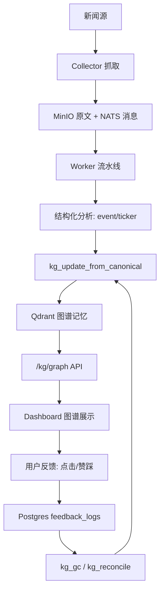
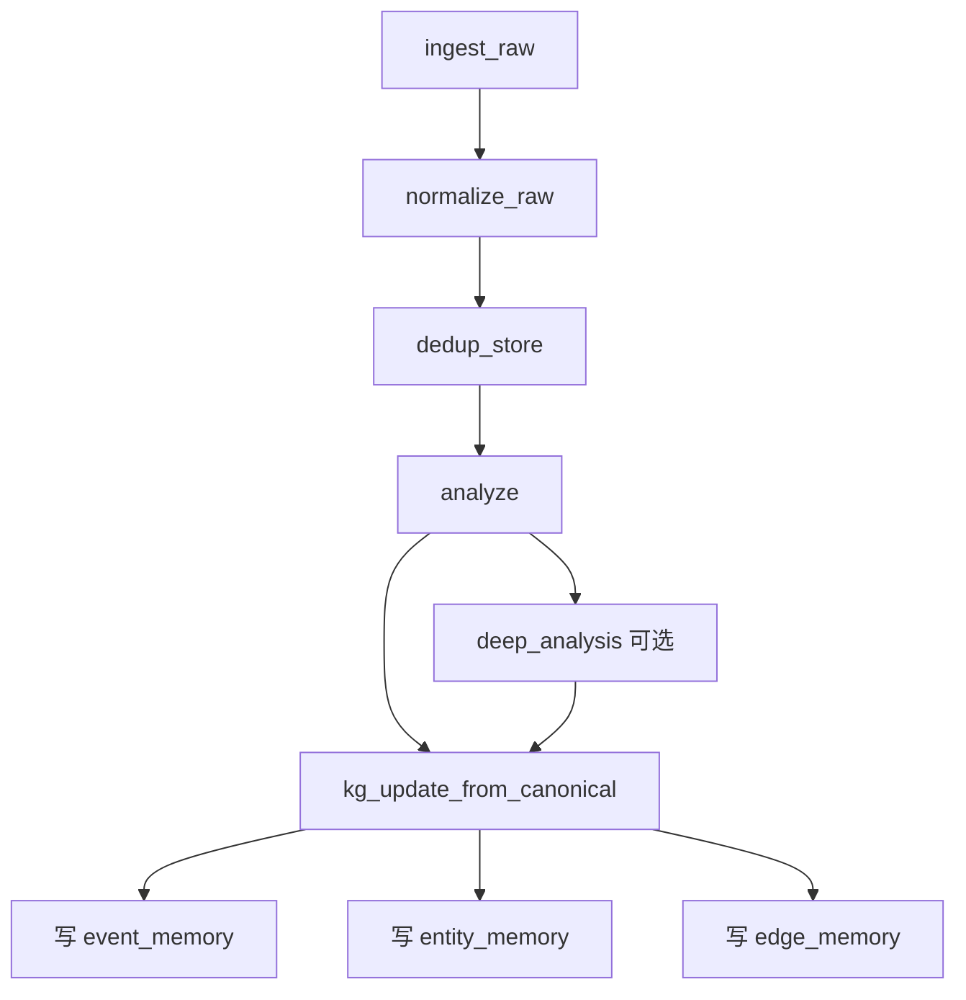
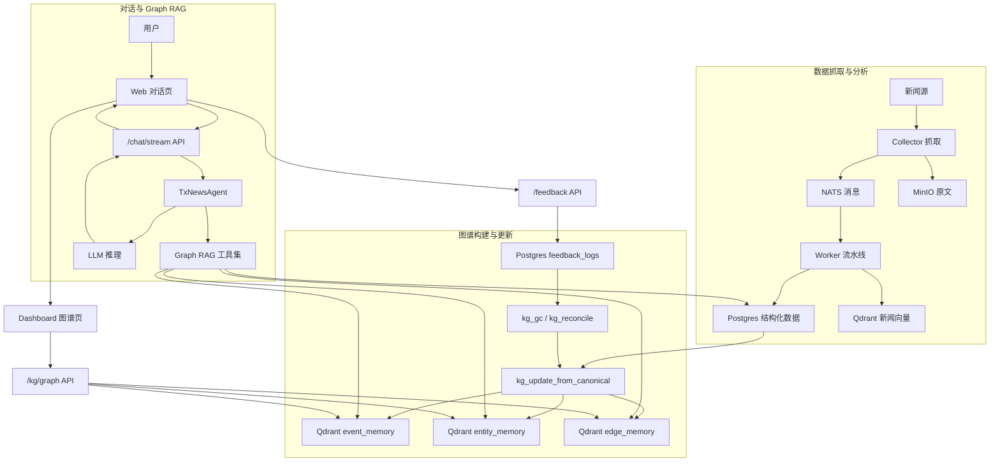
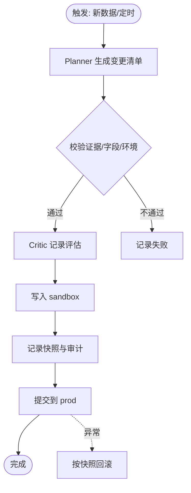

<!-- Input: v1 现状（采集/分析/检索）+ v2 目标与约束 -->
<!-- Output: v2 技术路线总结（架构、数据流、调用链、完整程序框图、图谱自我更新） -->
<!-- Pos: v2 技术路线说明（变更时同步更新以上注释与 docs/FOLDER.md；并同步更新涉及目录的 FOLDER.md） -->

# TX-News v2 技术路线总结

一句话概览：在 v1 的采集/分析基础上，补上“事件-实体-关系”图谱，并通过反馈与周期任务让图谱持续更新。

## 1. 这条路线要解决什么

- 从“新闻列表”走向“关系网络”，更容易看到事件之间的联系。
- 每条关系都能解释清楚：它从哪些新闻得来，为什么成立。
- 图谱能随新数据和用户反馈不断修正，而不是一写就固定。
- 出问题能回退，有审计、有快照，改错不怕。

## 2. 核心思路

- 事件是节点，A 股公司/股票是实体节点。
- 关系是边，每条边都带证据（canonical_id 列表）。
- Qdrant 保存图谱记忆（event/entity/edge），Postgres 保存审计/反馈。
- 新数据驱动图谱增长，反馈与治理任务让图谱变“更准”。
- 所有写入幂等；prod/sandbox 分离，必要时可回滚。

## 3. 模块与分工

- Collector：拉取新闻源，写入原始数据（MinIO）并发消息（NATS）。
- Worker 流水线：清洗、去重、分析，产出 event/ticker 等结构化信息。
- KG 任务：把结构化信息变成节点/边，写入图谱记忆。
- API：对外提供图谱数据与反馈入口。
- Web：展示图谱，收集点击/赞踩反馈。

## 4. 数据流

## 5. 调用链：从一条新闻到图谱

## 6. 图谱自我迭代/自我更新

### 6.1 新数据驱动

- 每条新闻分析后都会触发 `kg_update_from_canonical`。
- 事件节点使用统一模板生成 `snapshot_text`，便于稳定对比。
- 关系边会写 `reason_text` 和证据列表，保证可解释。

### 6.2 反馈驱动

- 前端点击/赞踩会上报 `/feedback`。
- 反馈进入 `feedback_logs`，成为调权与清理的依据。
- 有用的边权重上升，没用的边被降权或移除。

### 6.3 周期治理

- `kg_gc` 每小时处理控制边与旧边，避免图谱膨胀。
- `kg_reconcile` 每天重算事件快照，避免摘要“跑偏”。

### 6.4 完整程序框图

### 6.5 图谱更新流程

## 7. 关键数据落点

### 7.1 Qdrant：图谱记忆

| Collection | 作用 | 关键内容 |
| --- | --- | --- |
| `txnews_event_memory` | 事件节点 | `event_id`、`snapshot_text`、`canonical_ids`、`graph_env` |
| `txnews_entity_memory` | 实体节点 | `ts_code`、`name`、`description_text`、`graph_env` |
| `txnews_edge_memory` | 关系边 | `src/dst`、`relation`、`reason_text`、`evidence_canonical_ids` |

### 7.2 Postgres：审计与反馈

| 表 | 作用 |
| --- | --- |
| `feedback_logs` | 用户点击/赞踩反馈 |
| `kg_runs` | 每次图谱更新的运行记录 |
| `kg_ops_log` | Planner/Validator/Critic 的审计轨迹 |
| `kg_snapshots` | 回滚所需的快照数据 |

## 8. 对外接口与前端呈现

- `GET /kg/graph?minutes=180`：返回图谱节点/关系，用于 3D 图展示。
- `POST /feedback`：接收点击/赞踩，形成更新依据。
- `/dashboard` 图谱页：轮询 `/kg/graph`，显示节点关系与证据链接。

## 9. 关键规则与约束

- UI/API 不返回新闻全文，只给结构化结果和链接。
- 关系必须有证据：`evidence_canonical_ids` 不能为空。
- Node/Edge ID 保持稳定：`event:{event_id}` / `ticker:{ts_code}` / `edge:{src}|{relation}|{dst}`。
- 默认写入 `graph_env=prod`，但保留 `sandbox` 用于隔离与回滚。
- 先审计、后写入；失败可重试、可回滚。
