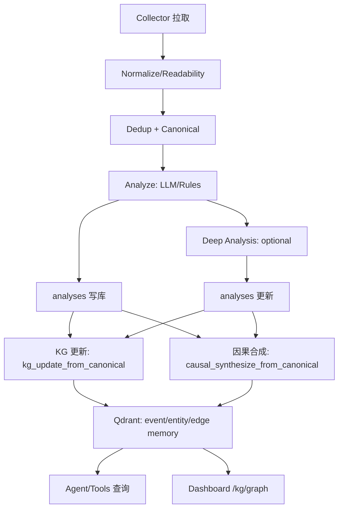
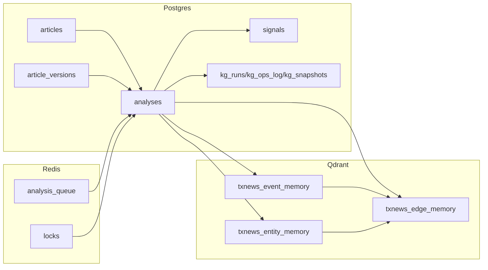
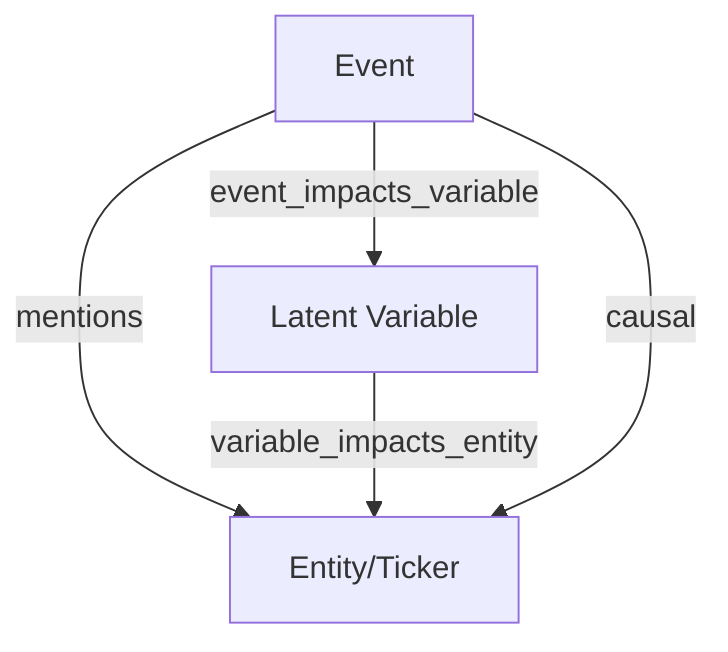
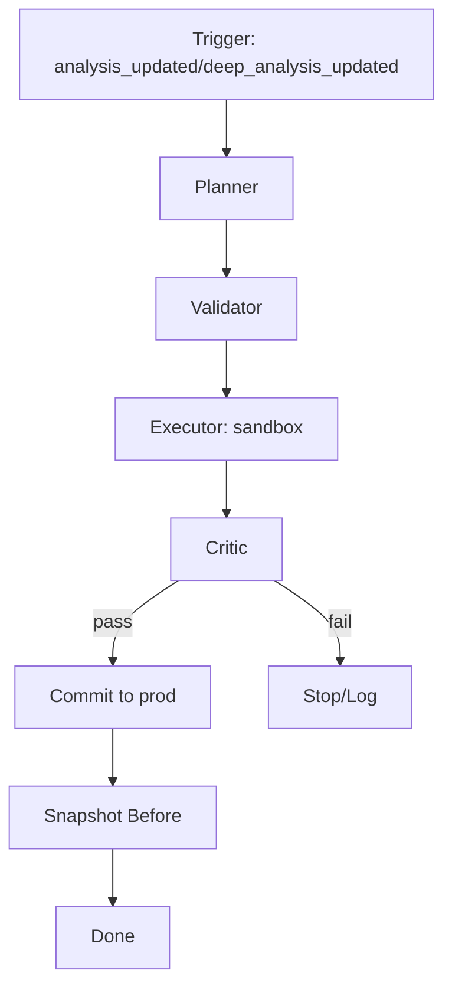
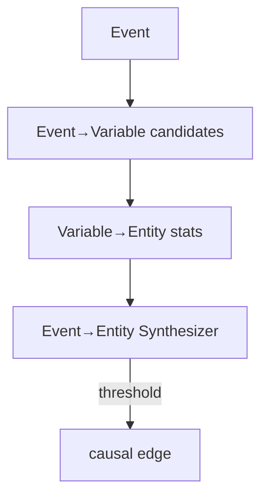
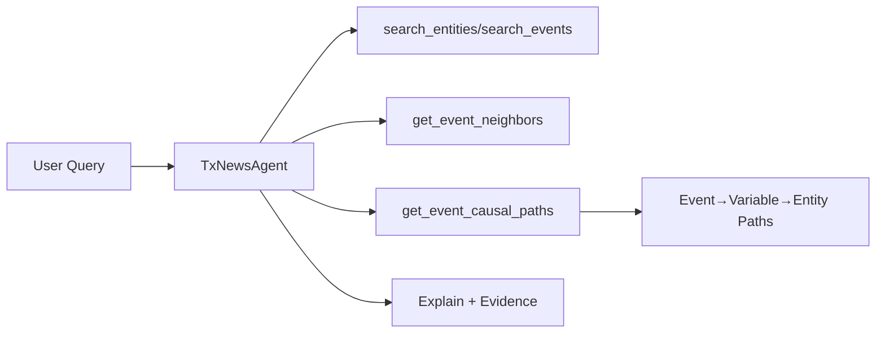
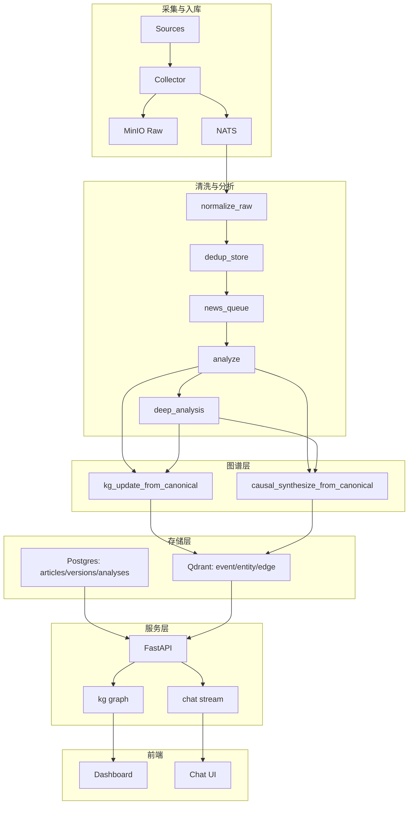
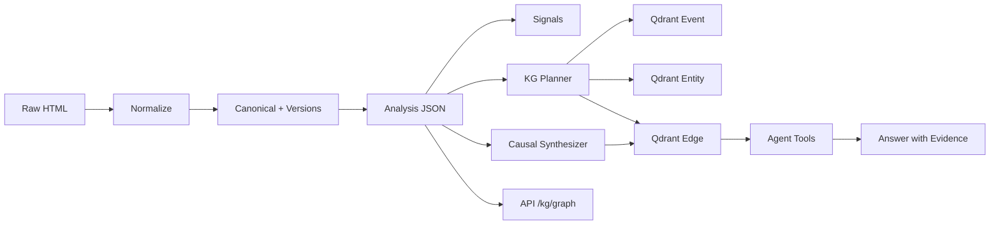

<!-- Input: v3 causal implementation + pipeline/KG/agent docs -->
<!-- Output: v3 causal workflows with diagrams (process/dataflow/logic) -->
<!-- Pos: v3 causal workflow doc (update header and docs/FOLDER.md on change) -->

# v3 因果图谱：流程/数据流/逻辑图与 KG 运行机制

本文件汇总 v3 因果图谱的完整运行方式，包含：程序流程图、数据流图、逻辑图，以及 KG（知识网络）运行机制细节。

> 说明：所有图示使用 Mermaid（可在 GitHub/支持 Mermaid 的 Markdown 渲染器中查看）。

---

## 0. 关键路径速览（含代码锚点）

- Analyze 写入并触发 KG + 因果合成：`src/tx_news/tasks/pipeline.py:435`
- Deep Analysis 修正后再次触发：`src/tx_news/tasks/deep_analysis.py:225`
- v3 因果合成任务入口：`src/tx_news/tasks/causal.py:627`
- 变量白名单与规范化：`src/tx_news/analysis/causal_vars.py:73`
- EventEntityCausalSynthesizer：`src/tx_news/tasks/causal.py:526`

---

## 0.1 伪代码（按模块）

### Analyze / Deep Analysis（结构化抽取）
```text
analyze(canonical):
  event_type = classify_event_type(text)
  event_id = stable_event_id(event_type, key_entity, window_start)
  tickers = match_tickers(text)
  result = {event_id, event_type, tickers, affected_variables: []}
  if llm_available:
    out = LLM(system, user)
    result.merge(out)
  result.affected_variables = normalize_affected_variables(result.affected_variables)
  upsert_analysis(result)
  emit_signal("analysis_updated")
  enqueue(kg_update_from_canonical)
  enqueue(causal_synthesize_from_canonical)
```

### KG Planner（event/ticker/variable/edges）
```text
kg_update_from_canonical(canonical_id):
  analysis = load_analysis(canonical_id)
  event_node = build_event_snapshot(analysis)
  ticker_nodes = upsert_tickers(analysis.tickers)
  event_vars = aggregate_event_variables(event_id)
  for var in event_vars:
    upsert_variable_node(var)
    upsert_edge(event_impacts_variable)
  upsert_mentions_edges()
  upsert_related_to_edges()
  commit_sandbox_then_prod()
```

### Causal Synthesizer（统计 + 合成）
```text
causal_synthesize_from_canonical(canonical_id):
  event_id = analysis.event_id
  event_vars = extract_event_variables(event_id)
  tickers = extract_event_tickers(event_id)
  var_entity_stats = build_stats(lookback_days, scopes, conflicts)
  upsert variable_impacts_entity edges
  for each ticker:
    for each variable:
      if passes_thresholds:
        score = combine(evidence_strength, consistency, temporal, path_support)
        apply_conflict_penalty()
        pick best path => emit causal edge
  commit_sandbox_then_prod()
```

## 1. 程序流程图（End-to-End）



---

## 2. 数据流图（表/库/集合）



---

## 3. 逻辑图（事件→变量→实体）



说明：
- `mentions/related_to` 保留为相关性边（correlation）。
- `event_impacts_variable` 来自 LLM 输出的变量白名单（候选）。
- `variable_impacts_entity` 来自统计回溯（稳定）。
- `causal` 由 EventEntityCausalSynthesizer 合成（显式门槛）。

---

## 4. KG（知识网络）运行机制

### 4.1 运行阶段



### 4.2 Planner 负责什么
- 生成可执行 GraphOpsPlan（节点/边）
- 确保边具备证据 `evidence_canonical_ids`
- v3 新增：
  - 变量节点 `latent_variable`
  - `event_impacts_variable` 候选边
  - `variable_impacts_entity` 统计边
  - `causal` 因果边

代码片段（Planner 关键增量）：
```python
# src/tx_news/tasks/kg.py (event -> variable candidates)
event_vars = _aggregate_event_variables(engine, canonical_ids, max_vars=max_vars)
for vinfo in event_vars:
    var_node_id = node_id_variable(vinfo["var"])
    ops.append(GraphOp(op="UPSERT_VARIABLE", item_id=var_node_id, ...))
    edge_key = edge_id(src=event_node_id, relation="event_impacts_variable", dst=var_node_id)
    ops.append(GraphOp(op="UPSERT_EDGE", item_id=edge_key, payload={...}))
```

### 4.3 Validator/Executor/Critic
- Validator：保证 payload 完整性（节点文本、边证据、reason_text）
- Executor：向 Qdrant 写入（sandbox → prod）
- Critic：当前为确定性 pass，可扩展为规则/质量门槛

### 4.4 回滚机制
- 每次 prod 写入前存 `kg_snapshots`
- 可通过 `kg_rollback(snapshot_id)` 回滚

---

## 5. 因果合成（EventEntityCausalSynthesizer）



### 5.1 合成条件（门槛）
- `event_var_confidence >= event_var_min_conf`
- `variable_impacts_entity.weight >= var_entity_min_weight`
- `support_events >= min_support`

代码片段（门槛 + 合成）：
```python
# src/tx_news/tasks/causal.py
if vconf < event_var_min_conf:
    continue
if edge_stats["weight"] < var_entity_min_weight:
    continue
if edge_stats["total"] < min_support:
    continue
```

### 5.2 置信度模型（显式分解）
示例：
```json
{
  "confidence": 0.78,
  "confidence_breakdown": {
    "support_events": 12,
    "same_direction_ratio": 0.83,
    "temporal_validity": 1.0,
    "recentness": 0.7,
    "conflict_ratio": 0.12,
    "path_support": 0.65,
    "event_var_confidence": 0.74
  }
}
```

---

## 6. 知识网络（KG）运行方式细节

### 6.1 触发
- `analysis_updated` / `deep_analysis_updated` → 异步触发
- 每次触发：
  - `kg_update_from_canonical` 维护 v2 KG
  - `causal_synthesize_from_canonical` 生成 v3 因果边

代码片段（触发位置）：
```python
# src/tx_news/tasks/pipeline.py
kg_update_from_canonical.delay(canonical_id)
causal_synthesize_from_canonical.delay(canonical_id)
```

### 6.2 并发与一致性
- Redis 分布式锁避免重复计算
- 规则幂等：event_id + ticker + relation 唯一
- 先写 sandbox，再批量提交 prod

### 6.3 GraphOps 结构
- Node: `event`, `ticker`, `latent_variable`
- Edge: `mentions`, `related_to`, `event_impacts_variable`, `variable_impacts_entity`, `causal`
- 所有边必须携带 `evidence_canonical_ids`

---

## 7. Agent 工具链（知识网络对话使用）



---

## 8. 后续可扩展模块

- `/kg/graph?include_causal=true`（展示因果边）
- `causal_replay` 离线回放任务（预测 vs 真实反馈）
- 更精细的行业/主题 scope 映射

---

## 9. 全项目工作流总览（Program Diagram）



---

## 10. 全项目数据流（更细粒度）



---

## 11. 关键逻辑链路（文字版）

1) Collector 抓取 → 标准化 → 去重 → canonical 入库。  
2) analyze 结构化输出（event/tickers/affected_variables）并写入 `analyses`。  
3) KG Planner：维护 event/ticker/mentions/related_to + event_impacts_variable。  
4) Causal Synthesizer：统计生成 variable_impacts_entity，并通过合成器折叠为 causal。  
5) API/Agent 读取 Qdrant + Postgres，输出证据链与路径解释。  

---

如需继续扩展接口与 UI 层，我可以直接补全 API + 前端展示方案。
